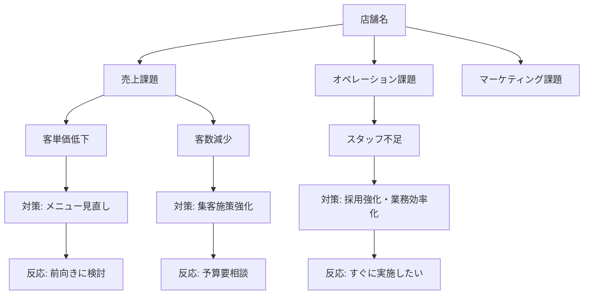

```mermaid
flowchart TD
    A[店舗名] --> B[売上課題]
    A --> C[オペレーション課題]
    A --> D[マーケティング課題]
    
    B --> B1[客単価低下]
    B --> B2[客数減少]
    
    B1 --> B1_S[対策: メニュー見直し]
    B1_S --> B1_R[反応: 前向きに検討]
    
    B2 --> B2_S[対策: 集客施策強化]
    B2_S --> B2_R[反応: 予算要相談]
    
    C --> C1[スタッフ不足]
    C1 --> C1_S[対策: 採用強化・業務効率化]
    C1_S --> C1_R[反応: すぐに実施したい]
```