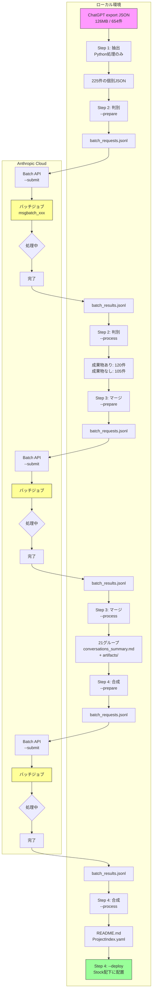
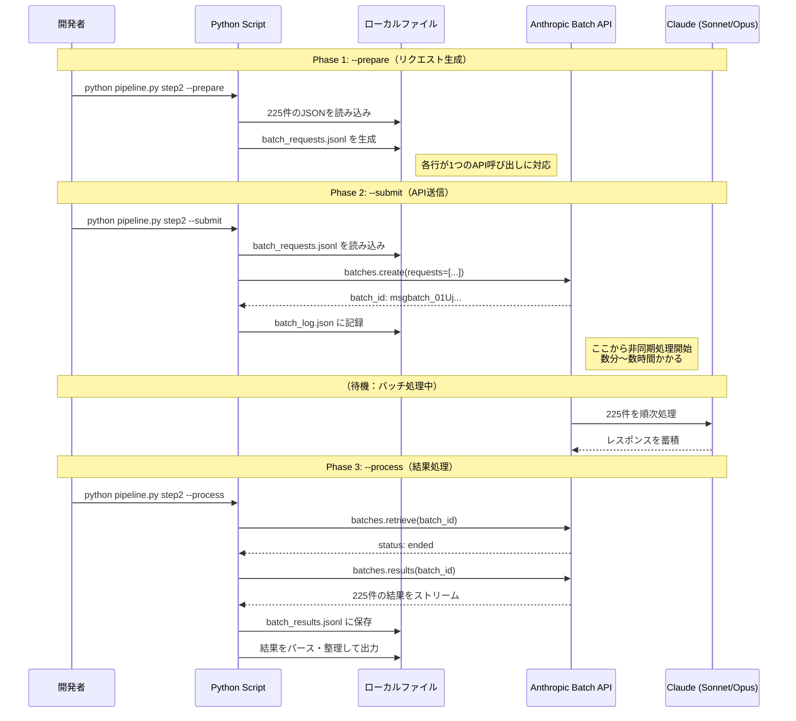
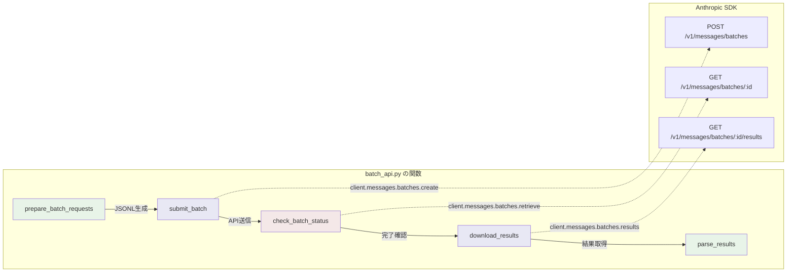
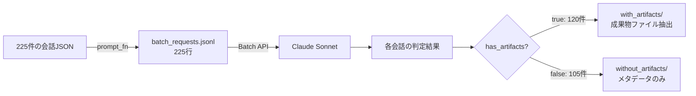
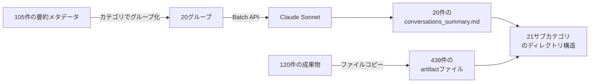
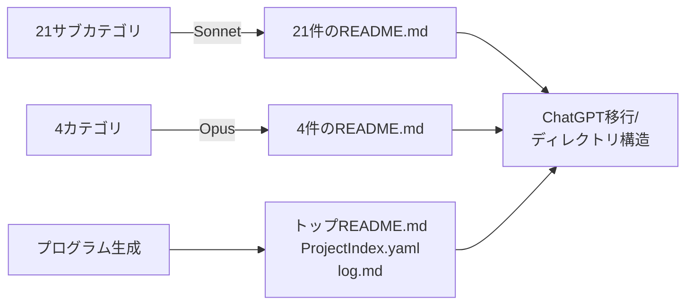
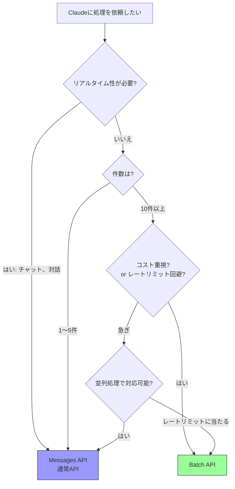

# Anthropic Batch API 解説 — ChatGPT履歴分析パイプラインを例に

## 1. Batch APIとは

Anthropic Batch APIは、**大量のClaudeへのリクエストを一括で非同期処理する仕組み**です。
通常のAPI（Messages API）が「1リクエスト送信 → 即レスポンス」なのに対し、Batch APIは「まとめて投げて、後でまとめて受け取る」方式です。

### 通常APIとBatch APIの比較

| 項目 | Messages API（通常） | Batch API |
|------|---------------------|-----------|
| 処理方式 | 同期（リアルタイム） | 非同期（バッチ処理） |
| レスポンス | 即時 | 数分〜数時間後 |
| コスト | 通常料金 | **50%割引** |
| レートリミット | 厳しい | 緩い（別枠） |
| 用途 | チャットボット、対話 | データ処理、分類、一括変換 |

### 料金比較（Sonnet 4の場合）

```
通常API:  入力 $3/MTok  出力 $15/MTok
Batch:   入力 $1.5/MTok 出力 $7.5/MTok  ← 半額
```

---

## 2. 全体アーキテクチャ

今回のパイプラインでは、Step 2〜4でBatch APIを使用しています。



---

## 3. Batch APIの3フェーズ構造

各ステップは必ず `--prepare → --submit → --process` の3フェーズで動きます。
この設計により、**各フェーズの間で人間が確認・修正・再実行**できます。



---

## 4. データフォーマット

### 4.1 リクエスト（batch_requests.jsonl）

1行 = 1リクエスト。JSONLフォーマット（1行1JSON）。

```json
{
  "custom_id": "conv_abc123",
  "params": {
    "model": "claude-sonnet-4-20250514",
    "max_tokens": 2048,
    "system": "あなたはChatGPT会話履歴の分析アシスタントです...",
    "messages": [
      {
        "role": "user",
        "content": "タイトル: 美容室の経営戦略\n日付: 2025-09-08\n..."
      }
    ]
  }
}
```

| フィールド | 説明 |
|-----------|------|
| `custom_id` | 結果との紐付けに使うユーザー定義ID。正規表現 `[a-zA-Z0-9_-]{1,64}` |
| `params.model` | 使用モデル。リクエストごとに変更可能 |
| `params.max_tokens` | 最大出力トークン数 |
| `params.system` | システムプロンプト |
| `params.messages` | 通常のMessages APIと同じ形式 |

### 4.2 レスポンス（batch_results.jsonl）

```json
{
  "custom_id": "conv_abc123",
  "result": {
    "type": "succeeded",
    "message": {
      "role": "assistant",
      "content": [
        {
          "type": "text",
          "text": "{\"has_artifacts\": true, \"summary\": \"美容室の経営戦略について...\"}"
        }
      ],
      "model": "claude-sonnet-4-20250514",
      "usage": {
        "input_tokens": 3500,
        "output_tokens": 450
      }
    }
  }
}
```

### 4.3 バッチログ（batch_log.json）

ローカルに保存する管理用ファイル。--processで使用。

```json
[
  {
    "batch_id": "msgbatch_01UjFWUwibrQeRhxEYKLZgeg",
    "status": "in_progress",
    "request_count": 225,
    "submitted_at": "2026-04-11T14:30:00"
  }
]
```

---

## 5. APIコールの流れ（コード対応）



### 対応する Python SDK コード

```python
import anthropic
client = anthropic.Anthropic(api_key="sk-ant-...")

# 1. バッチ作成（送信）
batch = client.messages.batches.create(
    requests=[
        {"custom_id": "req_001", "params": {"model": "claude-sonnet-4-20250514", ...}},
        {"custom_id": "req_002", "params": {...}},
        # ... 数百〜数千件
    ]
)
print(batch.id)  # "msgbatch_01Uj..."

# 2. ステータス確認（ポーリング）
batch = client.messages.batches.retrieve("msgbatch_01Uj...")
print(batch.processing_status)  # "in_progress" → "ended"
print(batch.request_counts.succeeded)  # 225

# 3. 結果取得（ストリーミング）
for result in client.messages.batches.results("msgbatch_01Uj..."):
    print(result.custom_id, result.result.type)
```

---

## 6. 今回のパイプラインでの使い方

### Step 2: 会話の判別（225件）



- **入力**: 会話テキスト全文（ユーザーメッセージは500文字に制限）
- **出力**: JSON（`has_artifacts`, `summary`, `keywords`, `artifacts[]`）
- **コスト**: 入力 ~100万トークン → 約$1.50（Batch割引後）

### Step 3: カテゴリ別マージ（20グループ）



- **入力**: 各グループの会話要約一覧
- **出力**: Markdown形式の会話サマリー
- **コスト**: 約$0.15

### Step 4: README合成（25件）



- **入力**: conversations_summary.md + artifacts一覧
- **出力**: AIOS形式のREADME.md
- **コスト**: Sonnet 21件 + Opus 4件 → 約$2.00

---

## 7. Batch APIを選ぶ判断基準



### Batch APIが適するケース

- **大量のデータ処理**: 分類、要約、翻訳、変換
- **コスト最適化**: 50%割引は大きい
- **レートリミット回避**: 通常APIとは別枠
- **結果の即時性が不要**: 数時間待てる場合

### 向かないケース

- チャットボットなどリアルタイム対話
- 1〜2件のアドホックな処理
- 結果を即座に次の処理に使いたい場合

---

## 8. 今回のコスト実績

| Step | モデル | リクエスト数 | 推定コスト |
|------|--------|:-----------:|----------:|
| Step 2 | Sonnet (Batch) | 225 | ~$1.50 |
| Step 3 | Sonnet (Batch) | 20 | ~$0.15 |
| Step 4 | Sonnet + Opus (Batch) | 25 | ~$2.00 |
| **合計** | | **270** | **~$3.65** |

通常APIで同じ処理をした場合: ~$7.30 → **Batchで約$3.65節約**

---

## 9. 3フェーズ設計のメリット

```
--prepare → 確認 → --submit → 待機 → --process
```

この設計により:

1. **--prepare後に確認**: 生成されたJSONLを目視チェック、プロンプト修正が可能
2. **--submit後に別作業**: バッチ処理中に他のコードを書ける（今回Step 3/4の実装をした）
3. **--process後にリトライ**: エラー分だけ再処理可能
4. **冪等性**: 各フェーズを何度実行しても壊れない設計

---

## 10. 参考リンク

- [Anthropic Batch API ドキュメント](https://docs.anthropic.com/en/docs/build-with-claude/batch-processing)
- [Anthropic Python SDK](https://github.com/anthropics/anthropic-sdk-python)
- 今回のコード: `Stock/バンコクPonさん案件/AIOS提供/ChatGPT分析/batch_api.py`
