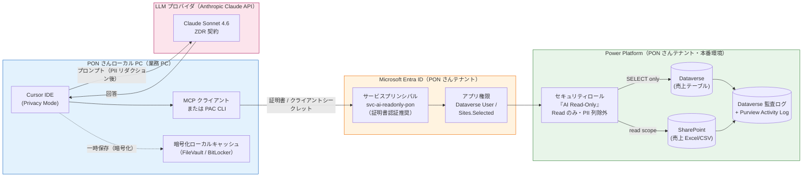

# PONさん 売上データ AI アクセス設計・IT担当者向け説得資料 v2

- BL: BL-0074
- 作成日: 2026-04-27（v2）／ v1: 2026-04-26
- 想定読者: PONさん側 IT担当者 / 近藤Pon社長 / 第6回セッション同席者（2026-04-27 月）
- 目的: PONさんが自社売上データを **ローカル PC の Cursor + MCP/CLI** から AI 活用するにあたり、IT 担当者の「データ漏洩・流出懸念」を技術構成と運用ルールで払拭する
- バージョン方針: v1 は構成案 4 案（A/B/C/D）の比較ドラフト。**v2 は前提確定後（2026-04-27 田中さん指示）に構成を 1 本に絞った IT 担当者向け説得版**

---

## 0. v1 → v2 の差分（ITが「v1 と何が違う」と聞いてきたとき用）

| 観点 | v1（4 案比較） | v2（前提固定） |
|---|---|---|
| バックエンド | 想定なし（汎用 POS / RDS Read Replica 等） | **PON さん自社 Power Platform（Dataverse=SQL バックエンド or SharePoint）** |
| アクセス端末 | 田中・町田を含む業務メンバ全般 | **PON さんのローカル PC（Cursor 稼働マシン）に限定** |
| 接続手段 | API + マスキングプロキシ等を新規構築 | **既存の Power Platform 公式接続経路（PAC CLI / Dataverse MCP / Microsoft Graph MCP）を使う** |
| 権限モデル | プロキシ層で SELECT のみ許可 | **Power Platform 側のセキュリティロールで読み取り専用を強制（DB 層で UPDATE/DELETE 不可）** |
| 認証 | 個人 SSO + API キー | **サービスアカウント（Microsoft Entra ID アプリ登録 = サービスプリンシパル）を新規発行** |
| 推奨案 | 案 D（集計値のみ）→ 案 B（マスキング API）の 2 段階 | **直接接続 + 読み取り専用 + サービスアカウント** の単一構成。集計値に絞らないので明細レベルの分析が可能 |
| データマスキング | プロキシ層で正規表現マスキング | **PII 列のセキュリティロール除外（列レベル）+ プロンプト前段の PII リダクション** の 2 段階 |
| インフラ追加 | Mac mini / VPC / プロキシなど新規構築 | **ハードウェア追加なし。既存 Power Platform + ローカル PC のみ** |

> v1 の案 A（ローカル LLM）/ 案 C（VPC + Bedrock）は**最終承認に向けた逃げ道として温存**。v2 構成で IT が NG を出した場合のフォールバックに使う。詳細は v1 を参照。

---

## 1. 確定アーキテクチャ

### 1.1 データフロー（mermaid）

### 1.2 構成要素サマリ

| 層 | 構成要素 | 役割 |
|---|---|---|
| 端末 | PON さん業務 PC（macOS / Windows） | Cursor + MCP クライアント / PAC CLI を稼働。**他端末からはアクセス不可** |
| クライアント | Cursor IDE（Privacy Mode 必須） | プロンプト/コードを Anthropic に送信。Cursor 自体の永続保存はしない設定 |
| 接続層（A 案） | **Microsoft 公式 Dataverse MCP Server**（または PAC CLI `pac data query`） | Power Platform 標準。Dataverse のテーブル/レコードを OData フィルタで読み取る |
| 接続層（B 案） | **Microsoft 365 MCP Server（`--read-only` フラグ）** | バックエンドが SharePoint の場合。Microsoft Graph 経由で Sites.Selected スコープ |
| 認証 | Microsoft Entra ID サービスプリンシパル `svc-ai-readonly-pon` | **証明書認証（推奨）**または短期クライアントシークレット |
| 認可 | Power Platform セキュリティロール「AI Read-Only」 | Read 権限のみ。Create/Write/Delete は付与しない。**PII 列はカラムレベルセキュリティで除外** |
| LLM | Anthropic Claude API（Cursor 経由） | **ZDR（Zero Data Retention）契約**前提 |
| 監査 | Dataverse 監査ログ + Purview Activity Log + Cursor 利用ログ | 「いつ・どのプリンシパルが・どのクエリで・どのテーブルを参照したか」を 1 年保管 |

> 接続層は A/B 単一に限定しないでよい。Power Platform 上のデータが **Dataverse 主体なら A**、**SharePoint Excel/CSV 主体なら B**。両方混在する場合は両方の MCP を Cursor に登録する（同じサービスプリンシパルで OK）。

---

## 2. データ漏洩リスク × 緩和策マッピング

IT 担当者が「漏れる可能性のある経路」を一通り潰せるかを確認するための表。**左列がリスク、右 2 列が「PON さん側で抑える策」と「Restaurant AI Lab 側 / IT 側で抑える策」**。

| # | リスク経路 | 想定脅威シナリオ | PON さん側の緩和策 | IT 側の緩和策 |
|---|---|---|---|---|
| R1 | LLM プロバイダ学習取込 | Cursor 経由で送ったプロンプトが Claude のモデル学習に使われる | Cursor を **Privacy Mode で運用**（Cursor 自身がプロンプトを保存しない） | Anthropic と **ZDR 契約**を締結（プロバイダ側ログ 0 日） |
| R2 | LLM プロバイダ側ログ漏洩 | Anthropic 側の事故・内部不正で会話ログが流出 | 同上（Privacy Mode で経由メタデータを最小化） | ZDR で保持期間 0。会話ログは PON さん側ローカルにのみ残る |
| R3 | サービスアカウント乗っ取り | サービスプリンシパルの証明書 / シークレットが漏洩し、第三者が Power Platform に直接接続 | 証明書を **PON さんローカル PC のキーチェーン / Windows 資格情報マネージャ**に保管。エクスポート不可設定 | **Conditional Access ポリシー**で接続元 IP（PON さんオフィス + 業務 PC）に制限。**シークレット 90 日ローテーション** |
| R4 | 過剰権限による全件 SELECT | サービスアカウントが全テーブル SELECT 可能で、AI が全件を吸い出す | プロンプトレベルでテーブル/期間を明示的に絞る運用 | **セキュリティロール「AI Read-Only」を最小権限で構成**。売上テーブル + 関連マスタのみ Read。PII 列はカラム除外 |
| R5 | 書き込み・更新事故 | AI が誤って UPDATE/DELETE を発行 | Cursor 上で破壊的 SQL 生成時は二段確認 | **DB 層で Read 権限のみ**。UPDATE/DELETE は Power Platform が拒否する（クライアント側の善意に依存しない） |
| R6 | プロンプトインジェクション | 売上テキスト内の悪意ある文字列が LLM を再操作し外部送信を誘発 | プロンプト前段で SQL 結果を JSON に正規化 | MCP 接続層は **Read 専用ツールのみ提供**（外部 HTTP 送信ツール非搭載） |
| R7 | スタッフ誤操作（PII 流出） | スタッフが顧客電話番号を Cursor に貼り付ける | **PON さんのみ Cursor 利用**（スタッフ全員に開かない）。利用ガイドに PII 取扱規定 | プロンプト前段の **PII リダクション**（電話番号・メール・LINE ID パターン検知 → マスキング） |
| R8 | ローカル PC 紛失・盗難 | PON さんの PC が盗まれてローカルキャッシュが取り出される | **OS 全ディスク暗号化（FileVault / BitLocker）必須**。**自動ロック 5 分**。**MDM 配下で遠隔ワイプ可能** | PC 紛失時の即時手順: ① Entra ID から SP 失効、② 証明書失効、③ 当該デバイス Conditional Access ブロック |
| R9 | 監査・証跡不備 | 後から「誰がどのデータを見たか」を追えない | プロンプト履歴は PON さんローカルに残し IT 共有可能にする | **Dataverse 監査ログ ON**（テーブル/列レベル）+ **Microsoft Purview Activity Log**（プリンシパル単位の API コール）を 1 年保管 |
| R10 | 越境送信（PDPA） | タイ国内データが米国・日本の Anthropic サーバへ越境 | プロンプト前段で **PII リダクション**済の集計済テキストのみ送信 | Anthropic Claude API は **シンガポールリージョン**選択可。ASEAN 域内処理に留める |
| R11 | Cursor のローカルキャッシュ漏洩 | Cursor が一時保存するファイルキャッシュから第三者が読み取る | OS 全ディスク暗号化 + 自動ロック | Cursor は**クライアント生成キーで暗号化**しサーバ側はリクエスト終了で破棄。Privacy Mode 推奨 |
| R12 | ベンダー（Restaurant AI Lab）からの漏洩 | 田中・町田など外部協力者経由で漏洩 | **本構成では田中・町田は Power Platform に直接接続しない**（PON さんローカル PC のみ） | サービスプリンシパルの管理権限は PON さん IT が保有。Restaurant AI Lab は構成支援のみ |

> このマッピングのうち **R1/R2/R5/R9/R10/R11** は、本資料 v1 で IT 担当者が懸念しがちと整理した上位 3 件（学習取込・越境送信・ログ漏洩）に該当する。v2 では追加で R3/R4/R7/R8/R12 を **「サービスアカウント＋ローカル PC」構成だからこそ生じる新規リスク**として明示し、緩和策をすべて埋めている。

---

## 3. 接続手段の比較（A 案: PAC CLI / Dataverse MCP, B 案: M365 MCP）

PON さんの Power Platform バックエンドが **Dataverse（SQL 相当）か SharePoint か**で推奨経路が変わる。両方混在ならどちらも使ってよい。

| 観点 | A1: PAC CLI (`pac data query`) | A2: Dataverse MCP Server | B: Microsoft 365 MCP Server (`--read-only`) |
|---|---|---|---|
| 公式性 | ◎ Microsoft 公式 | ◎ Microsoft 公式（2026/04 リリース）+ コミュニティ実装も多数 | ○ コミュニティ実装が中心（Softeria 等）。Microsoft 公式 MCP もエンタープライズ向けに登場 |
| 対応バックエンド | Dataverse | Dataverse（OData フィルタ） | SharePoint / Excel / OneDrive 等 Microsoft 365 全般 |
| 認証 | サービスプリンシパル（`pac auth create -id <appId> -cs <secret> -t <tenantId>`） | Client ID / Client Secret / Tenant ID（証明書認証も可） | Sites.Selected または Sites.Read.All（証明書認証推奨） |
| 読み取り専用化 | セキュリティロールで強制 | 同上 | `--read-only` フラグで MCP ツール側でも Write 系を非搭載に |
| Cursor との接続 | CLI コマンドを Cursor の Bash で呼び出す（Agent 経由） | `~/.cursor/mcp.json` に直接登録 | 同左 |
| 監査ログ | Dataverse 監査ログ | 同上 | Purview Activity Log（Microsoft 365 単位） |
| PON さん運用負荷 | 低（PAC CLI を 1 度設定） | 中（MCP サーバプロセスを Cursor 起動時に立ち上げ） | 中（同上） |

### 推奨：**A2（Dataverse MCP）+ 必要に応じて B（M365 MCP）の併用**

- 売上の主データが Dataverse 表にあるなら A2 を主軸。Cursor と最も親和性が高く、OData フィルタで「2026-04 の売上のみ」のような期間指定が効く
- 売上の元帳が SharePoint 上の Excel/CSV なら B を併用。`--read-only` を必ず付与
- A1（PAC CLI）は **検証期と障害時のフォールバック**で残す。Cursor 内で `pac auth list` / `pac data query` を直接走らせるバックアップ経路として有用

---

## 4. サービスアカウント運用ルール（IT が普段運用していない前提で詳細化）

> **重要**: IT 担当者がサービスプリンシパルを今まで運用していない可能性があるため、本節は「運用負荷込み」で書く。BL-0054（共用リポジトリ設計）が固まっていれば併用可。

### 4.1 命名規則

| 項目 | 規則 | 例 |
|---|---|---|
| Entra ID アプリ表示名 | `svc-<用途>-<権限>-<対象>` | `svc-ai-readonly-pon` |
| アプリ ID（GUID） | 自動採番 | （Entra ID が払い出す GUID） |
| Power Platform セキュリティロール名 | `AI Read-Only - <対象>` | `AI Read-Only - Sales` |
| 証明書 CN | `CN=svc-ai-readonly-pon.<tenant-domain>` | `CN=svc-ai-readonly-pon.pon-rio.onmicrosoft.com` |

### 4.2 権限スコープ（最小権限）

- **Dataverse**: 売上関連テーブル（`Sales`, `Orders`, `Customers` など）に Read のみ。`Customers` テーブルの `phone`, `line_id`, `email` 列は **カラムレベルセキュリティ**でロール除外
- **SharePoint**: `Sites.Selected` で売上 Excel が置かれているサイトのみ。`Sites.Read.All` は **NG**（テナント全体に拡大するため）
- **Power Apps / Automate**: 不要 → 付与しない

### 4.3 認証情報の保管・配布

| 認証方式 | 保管先 | 配布方式 | ローテーション |
|---|---|---|---|
| **証明書（推奨）** | PON さん業務 PC の OS キーチェーン（macOS Keychain / Windows 資格情報マネージャ）。エクスポート不可 | 初期セットアップ時に IT 担当者が PON さん PC で対面/RDP セットアップ | **1 年ごとに更新**（自動失効通知あり） |
| クライアントシークレット（次善） | 同上 + 1Password Business（IT のみアクセス） | Azure Portal で発行 → 暗号化して PON さん PC に投入 | **90 日ごとにローテーション**（Microsoft 推奨上限 24 ヶ月だが業務 PC 用途では短く） |

### 4.4 Conditional Access（接続元制限）

- **必須**: PON さんオフィスの固定 IP + PON さん業務 PC（MDM 登録済デバイス）からのみ接続許可
- **任意**: 出張時用に Microsoft Authenticator MFA を介した一時例外を許可（IT 承認制）
- **Block**: 上記以外からの当該サービスプリンシパル経由のサインインは全拒否

### 4.5 監査・運用

| 運用項目 | 頻度 | 実施者 | 内容 |
|---|---|---|---|
| Dataverse 監査ログ確認 | 月次 | PON さん IT | サービスプリンシパル名でフィルタし、想定外テーブルへのアクセス無を確認 |
| Purview Activity Log 確認 | 月次 | 同上 | サインイン元 IP・成功失敗・API 呼出件数のトレンドチェック |
| 証明書 / シークレット失効期限チェック | 四半期 | 同上 | Entra ID 管理画面の Expiry Notification を確認 |
| インシデント対応訓練 | 年次 | IT + 田中 | 「サービスプリンシパル乗っ取り疑い」の机上訓練（失効・遮断・通報の手順確認） |

### 4.6 即時失効手順（PC 紛失・退職等）

1. Entra ID 管理画面で `svc-ai-readonly-pon` を **Disable**（即時。SSO で 5 分以内に伝播）
2. 当該サービスプリンシパルの証明書/シークレットを全削除
3. PON さん業務 PC を **MDM から遠隔ワイプ**
4. Dataverse 監査ログから直近 30 日のアクセス履歴を抽出 → 異常確認
5. 必要なら新サービスプリンシパル（`svc-ai-readonly-pon-v2`）を再発行

---

## 5. 想定 Q&A（IT 担当者から出る質問・10 件以上）

### Q1. 「Cursor が結局 LLM ベンダー（Anthropic）にデータを送るなら、案A（ローカル LLM）の方が安全では？」

A1. その指摘は半分正しいが、**コストとモデル性能の天秤**で本構成を選んでいる。具体的には:
- Anthropic との **ZDR 契約**で「学習に使わない・ログを保持しない」を契約レベルで担保
- **Cursor を Privacy Mode で運用** → Cursor 自身も保存しない
- 送るのは「PII リダクション後の SQL 結果と質問文」のみで、生の顧客 PII は送らない設計
- それでも IT が NG なら案 A（Mac mini + Ollama）に切替可能。**ハードウェア投資 38 万円・実装 3-4 週**を許容できるかが分岐点

### Q2. 「Cursor のローカルキャッシュに売上データが残るのが怖い」

A2. 3 段階で抑える:
1. **OS 全ディスク暗号化（FileVault / BitLocker）必須** → PC 紛失時に第三者が読み取れない
2. **Cursor は Privacy Mode** → サーバ側にはクライアント生成キーで暗号化された一時データのみ。リクエスト終了でキー破棄
3. **業務 PC のみで利用** → 個人 PC や持ち出し PC では Cursor 設定で当該 MCP を使えないようにする（プロファイル分離）

### Q3. 「サービスアカウントの証明書が漏れたら全件抜かれませんか？」

A3. 4 段階で塞ぐ:
1. **証明書はキーチェーン保管・エクスポート不可** → ファイルとしてコピーできない
2. **Conditional Access で IP/デバイス制限** → 漏れた証明書を別環境で使ってもサインイン拒否
3. **Power Platform セキュリティロールが Read のみ + PII 列除外** → 抜かれても被害は売上集計レベル（顧客識別子なし）
4. **Dataverse 監査ログで異常検知** → 月次で異常パターンをアラート化

### Q4. 「Power Platform の標準ロールでは細かく権限を絞れないのでは？」

A4. **カスタムセキュリティロール**でテーブル単位・列単位まで絞れる。具体的には:
- テーブル単位の `Read/Create/Write/Delete/Append/AppendTo` を個別 ON/OFF
- **カラムレベルセキュリティ**で `Customers.phone`, `Customers.line_id` 等の列だけ非表示にできる
- 行レベルセキュリティ（BU 単位）で「特定店舗のみ」も可能。今回は全店舗 Read 想定だが、将来店舗別に絞ることも可

### Q5. 「監査ログは PDPA の要件（保管 1 年）を満たせますか？」

A5. **Dataverse 監査ログ + Microsoft Purview Activity Log の併用**で満たす:
- Dataverse 監査ログ: テーブル/列レベルの参照・更新を記録（標準で 30 日、設定で延長可）
- Microsoft Purview: サインインイベント・API コールを **最大 1 年保管**（E5 ライセンス・追加で 10 年）
- 必要に応じて月次で CSV エクスポートし PON さんローカル / Google Workspace（既存運用）にバックアップ

### Q6. 「サービスアカウントの管理は IT が普段やっていない。運用が回るのか？」

A6. 4 つの運用負担を明示し、**最小限で済む設計**にしている:
- 月次: 監査ログを 15 分眺める（異常パターンチェック表を提供）
- 四半期: Entra ID の証明書 Expiry 通知を確認
- 1 年: 証明書の更新（自動通知 30 日前）
- インシデント時: 4.6 節の 5 ステップを実行（手順書あり）

実運用支援は田中（Restaurant AI Lab）が**最初の 90 日 SLA で寄り添い**、その後は IT 単独で回せる状態に持っていく。

### Q7. 「タイの売上データが米国の Anthropic に流れる。PDPA 違反では？」

A7. 3 つの理由で PDPA リスクを最小化している:
1. **PII リダクション**: 顧客名・電話・LINE ID は MCP 経由のクエリ段階でカラム除外、プロンプト段でも正規表現マスキング → 「個人データ」に該当しない情報のみ送信
2. **Anthropic シンガポールリージョン**を選択可（ASEAN 域内処理）
3. **越境送信が必要なら DPA 締結**: Anthropic の Data Processing Addendum を IT が確認可能（PON さん→田中→Anthropic の 3 者書面）

### Q8. 「Cursor の更新で勝手に挙動が変わる懸念は？」

A8. 3 つの予防策:
- **Cursor のバージョンを業務 PC で固定**（マイナーアップデート以外は手動承認）
- **Privacy Mode 設定の自動チェック**（起動時に有効性確認するスクリプトを用意）
- **MCP サーバ側のスキーマ変更通知**を Restaurant AI Lab が監視し、PON さん IT に四半期レポート

### Q9. 「PON さんが間違えて『全顧客の電話番号を取って』と AI に依頼したら？」

A9. 2 重で防ぐ:
1. **DB 層**: `Customers.phone` 列はサービスアカウントから見えない（カラムレベルセキュリティ）→ そもそもクエリしても NULL / 列存在せず
2. **プロンプト層**: PII 検出時に Cursor が警告 + ログ。MCP 側でも電話番号パターン検知時はフィルタ

### Q10. 「Cursor から Bash で任意コマンド実行できると、データ持ち出しの抜け道では？」

A10. 4 段階で塞ぐ:
- Cursor の **Bash 実行は PON さん業務 PC 内に閉じる**（クラウド実行ではない）
- 業務 PC は **MDM 配下** → 外部ストレージ書き出し制限可能
- ファイアウォール/プロキシで外部送信先を **Anthropic API + Microsoft 365 のみ許可**
- 監査として、Cursor 操作ログ（プロンプト履歴）を PON さんローカルに 90 日保管

### Q11. 「サービスアカウントが死んだ（証明書失効など）ときの業務影響は？」

A11. 影響範囲を限定:
- 影響: PON さんの Cursor 経由 AI 分析のみ。**通常の業務システム（Power Apps, Dynamics, SharePoint UI）には影響しない**（別アカウント）
- 復旧: 4.6 節の手順で新規サービスプリンシパル発行 → Cursor 設定更新（30 分以内）
- 暫定: 復旧中は v1 の案 D（既存 BI から集計値貼り付け）に一時退避可能

### Q12. 「Restaurant AI Lab（田中・町田）が PON さんデータにアクセスする経路は？」

A12. **本構成では田中・町田は Power Platform に直接接続しない**:
- 設計レビュー・コード支援は PON さん業務 PC で田中が同席実施（画面共有）
- 田中・町田用にサービスプリンシパルを別途発行する場合は **別ロール（より制限的）+ IT 承認** 前提
- 緊急時のリモート支援は **MDM の遠隔操作** + IT 立会で実施

### Q13. 「Microsoft が 2026 年 3 月以降サービスプリンシパル無し認証を無効化すると聞いた。影響は？」

A13. **本構成は最初からサービスプリンシパル明示型**のため影響なし。Entra ID は 2026/03 以降「マッチするサービスプリンシパルが無いエンタープライズアプリの認証を拒否」する仕様変更を予告している。本構成は **`svc-ai-readonly-pon` を新規発行する前提**で、この仕様変更に最初から準拠している。

### Q14. 「コストはどのくらい？」

A14. 月額レンジ:
- Anthropic Claude API（ZDR 込み）: 月 100 万トークン想定で **$3-15 / 月**（USD）
- Cursor Pro/Business: **$20-40 / 月** / ユーザ
- Microsoft Power Platform: **既存ライセンスで吸収**（Dataverse / Purview 監査は P1/P2 ライセンスで使える範囲）
- 合計: **月 5,000〜10,000 円程度** 見込み（PON さん 1 名利用）

### Q15. 「もし問題が起きたら誰が責任を取りますか？」

A15. 役割を明確化:
- **データオーナー**: PON さん（最終責任）
- **インフラ管理**: PON さん IT（サービスプリンシパル・Entra ID・Power Platform 設定）
- **ツール構成**: 田中（Restaurant AI Lab）が Cursor / MCP / プロンプト設計を一次サポート
- **インシデント時**: 24 時間以内に 3 者レビュー会、原因究明と再発防止策を文書化（v1 と同じ）

---

## 6. 残懸念事項・要確認事項（PON さん IT へ事前ヒアリング推奨）

| ID | 確認事項 | 影響 |
|---|---|---|
| C1 | **バックエンドが Dataverse か SharePoint か（あるいは両方）** | 接続手段（A2/B/併用）の確定に必要 |
| C2 | **Microsoft Entra ID の管理権限を IT が持っているか**（テナント管理者か共同管理者か） | サービスプリンシパル発行手続きの所要時間 |
| C3 | **Conditional Access のライセンス（Entra ID P1 以上）の有無** | IP/デバイス制限の実現可否 |
| C4 | **Microsoft Purview / Audit Log のライセンスエディション** | 監査ログ 1 年保管の可否 |
| C5 | **PON さんの業務 PC が MDM（Intune / Jamf 等）配下か** | 遠隔ワイプ・端末制限の可否 |
| C6 | **証明書認証 vs クライアントシークレット**の運用許容度 | 推奨は証明書、IT 慣れていなければシークレット 90 日ローテで開始 |
| C7 | **PON さん以外（スタッフ）への展開予定の有無** | あれば設計を multi-user 対応で再検討 |
| C8 | **既存 Cursor 利用ポリシー**（Privacy Mode が組織標準か） | Cursor Business 契約 + Privacy Mode 強制で満たせる |

---

## 7. 月曜セッションでの進め方（30 分想定・v1 から差し替え）

| 時間 | アジェンダ | 担当 |
|---|---|---|
| 0-3 分 | v1 → v2 の前提変更を共有（バックエンドが Power Platform に確定したこと）| 田中 |
| 3-10 分 | 1 章のアーキテクチャ図 + 2 章のリスク × 緩和策マッピング提示 | 田中 |
| 10-18 分 | 5 章の Q&A から IT が気にする点を 3-5 件抽出して即答 | 田中 + 町田 |
| 18-25 分 | 6 章の C1-C8 を IT に確認 → A2/B/併用 のどれで進めるか合意 | PON さん IT + 田中 |
| 25-30 分 | 着手スケジュール（W1: SP 発行 + ロール作成 / W2: Cursor + MCP 設定 / W3: パイロット運用 / W4: 監査ログレビューと正式運用） | 全員 |

---

## 8. 付録: 参照ドキュメント

### Microsoft 公式

- Connect to Dataverse with model context protocol (MCP) — Power Apps | Microsoft Learn
- Microsoft Power Platform CLI data command group — Power Platform | Microsoft Learn
- Manage Dataverse Service Principal Connections Using PAC CLI — `pac connection update -t <tenant> -a <appId> -cs <secret>`
- Get Started With the Microsoft MCP Server for Enterprise — Microsoft Graph | Microsoft Learn
- Manage Dataverse auditing — Power Platform | Microsoft Learn
- View Microsoft Dataverse and model-driven app activity logs in Microsoft Purview
- Creating a service principal application using API — Power Platform | Microsoft Learn

### コミュニティ実装（参考）

- michsob/powerplatform-mcp（GitHub）— PowerPlatform CLI and MCP tools
- RuniThomsen/powerplatform-mcp（GitHub）— MCP Server for Powerplatform dataverse
- Softeria/ms-365-mcp-server（GitHub）— Microsoft 365 MCP Server with `--read-only` flag

### Cursor 公式

- Cursor Privacy and Data Governance（Enterprise）
- Cursor Data Use & Privacy Overview
- Cursor Ghost Mode（Privacy Mode）

---

## 改訂履歴

- 2026-04-26 v1 作成（4 案比較ドラフト）
- 2026-04-27 v2 作成（前提確定: Power Platform / 読み取り専用 / サービスアカウント / ローカル Cursor + MCP・CLI）
