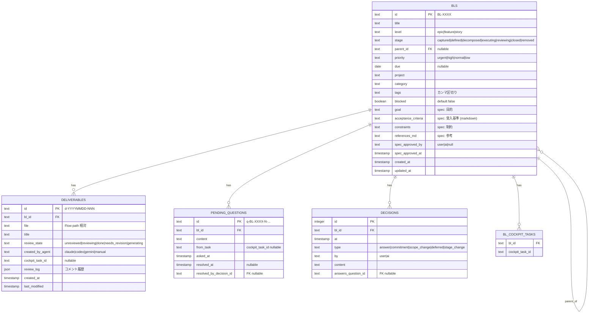

# データモデル ER + ユースケース一覧

- 作成日: 2026-06-08
- 起票者: master (Claude)
- 関連 BL: BL-0095
- 前 doc: `task_lifecycle_v2.md` (d-20260608-001)
- 目的:
  1. spec を BL から分離する意義の整理（田中さんの問い）
  2. Mermaid ER 図でデータ構造を可視化
  3. **ユースケース一覧**を網羅して、後続「各ケースのデータフロー設計」の入口を作る

---

## 1. 田中さんの問い: spec は BL のプロパティでよくない？

### 1.1 結論

**1 テーブル統合を推奨**。理由は下記。spec を別テーブルに分けるメリットは現段階では薄い。

### 1.2 分離 vs 統合の比較

| 観点 | 分離（specs テーブル） | 統合（bls にカラム） |
|---|---|---|
| 関係 | 常に 1:1 | 1:1 |
| クエリ複雑度 | JOIN 必要 | 単純 |
| スキーマ拡張 | 容易（spec 専用に拡張可） | カラム増えるとテーブル幅広がる |
| spec バージョニング | 容易（versionedテーブル化可） | 履歴は別 (`decisions`) |
| 「spec なし captured 状態」表現 | spec 行なしで自然 | NULL カラム |
| 教育コスト | 「なんで分けてるの？」と聞かれる | 「BL = タイトル + 詳細」で直感的 |

### 1.3 何を捨て、何を取るか

- 分離の **真の旨味は spec バージョニング**（履歴を全部残す）
- 現状の運用では `decisions[]` で「いつ何が変わったか」は十分追える
- → スペック自体の世代管理を要件にしないなら、**統合が単純で良い**

### 1.4 採用ルール

- `bls` テーブルに `goal` / `acceptance_criteria` / `constraints` / `references_md` を直接持つ
- 全て NULLABLE（captured 段階では空）
- 後で spec 世代管理が必要になったら、`spec_revisions` テーブルを追加して history を貯める形に拡張（破壊的変更にならない）

---

## 2. 親子関係: Epic / Feature / Story の 3 段階

田中さん決定。`bls.level` ENUM で表現:

| level | 役割 | 典型サイズ | 親 |
|---|---|---|---|
| `epic` | 大目標 / 製品 / プロジェクト相当 | 数週〜数ヶ月 | null（最上位） |
| `feature` | 1 機能 / 1 サブ目標 | 1〜2 週間 | Epic |
| `story` | AI が 1 セッションでやる単位 | 数時間 | Feature（または Epic 直下も可） |

`parent_id` の制約:
- `epic.parent_id` = null
- `feature.parent_id` = `epic.id`
- `story.parent_id` = `feature.id` または `epic.id`

ライフサイクル (`stage`) は全 level で同じ 8 段階だが、典型的な使い方は異なる:
- Epic は CAPTURE → DEFINE で一度作って、子の集合で実質進む（自身は EXECUTE しない）
- Feature は DECOMPOSE が中心
- Story は 8 段階を全部回す

---

## 3. ステージ遷移ログ: 一旦見送り推奨

田中さんが迷っていた点。判断材料:

| 観点 | 採用する場合 | 採用しない場合 |
|---|---|---|
| 分析（redefine 頻度等） | 容易 | 困難 |
| 監査 / デバッグ | 完全 | `decisions[]` で部分的 |
| 書き込みコスト | 全遷移で 1 INSERT | 0 |
| テーブル数 | +1 | 維持 |
| 後付け可能性 | - | 容易（後から `transitions` 追加可） |

**推奨: 一旦見送り**。理由:
- 重要な遷移（scope_change / removed）は `decisions[]` に書く運用にすれば、分析もある程度可能
- `bls.updated_at` で「最後にいつ動いたか」は分かる
- 必要性が見えてから足せばよい（破壊的変更にならない）

→ 後述 ER 図には `transitions` を載せず、`decisions` で代替する形にする

---

## 4. ER 図 (Mermaid)

### 4.1 補足

- `bls` テーブルにすべての spec フィールドを直接持つ（§1 の結論）
- `parent_id` は self-referencing FK で 3 段階 (`level` enum) を表現
- `transitions` テーブルは作らない（§3）
- 重要 stage 変化は `decisions(type='stage_change')` に書く運用で代替可

### 4.2 stage の取りうる値（再掲）

| stage | 説明 |
|---|---|
| captured | 1 行 goal が入っただけ、spec 未着手 |
| defined | spec 承認済み、分解前 |
| decomposed | 分解完了、実行待ち |
| executing | AI が動いている |
| reviewing | deliverable 完成、田中さんレビュー待ち |
| closed | 完了 |
| removed | 廃棄 |

---

## 5. ユースケース一覧（網羅版）

田中さんの中心 4 目的:
- (a) タスク一覧の管理
- (b) スケジュールの管理
- (c) AI への指示
- (d) AI 成果物のレビュー

カテゴリ A〜L で網羅。後続のデータフロー設計で 1 ケース 1 ケース順に処理する想定。

### A. タスクの生成・キャプチャ

| # | ユースケース | チャネル |
|---|---|---|
| A1 | ミーティング議事録から AI が action item を抽出 → 田中さんが triage | 🗣 Meeting |
| A2 | iPhone で「思いつき」を 1 行で投稿 | ✋ Adhoc |
| A3 | 完了 BL の CASCADE で提案された新 BL を accept | ⛓ Cascade |
| A4 | 親 (Feature) の DECOMPOSE で AI が子 (Story) を提案 → 田中さん accept | 🗂 WBS |
| A5 | 既存 BL を「これは Epic だ」と昇格、その下に Feature 群を作る | meta |
| A6 | 外部から HTTP POST で BL 起票（将来: Slack / Calendar 連携） | adhoc 拡張 |

### B. タスクの定義 (DEFINE)

| # | ユースケース |
|---|---|
| B1 | CAPTURE 直後に AI が spec 4 フィールドを自動下書き |
| B2 | 田中さんが受け入れ基準を編集して approve |
| B3 | REVIEW 後に「spec が違った」と気づき redefine（spec を更新） |
| B4 | 似た過去 BL を refs にリンク（AI が候補提示） |
| B5 | spec をテンプレートから新規作成（雛形読み込み） |

### C. 分解 (DECOMPOSE / WBS)

| # | ユースケース |
|---|---|
| C1 | 親の DECOMPOSE で AI が子 3〜5 個を提案 |
| C2 | Epic を Feature に分解 |
| C3 | Feature を Story に分解 |
| C4 | 「これは 1 個で十分」で decompose スキップ |
| C5 | 後から子 BL を追加（forgotten subtask） |
| C6 | 子 BL を別の親に move（誤分類修正） |
| C7 | 同階層の BL を 1 個に merge（重複） |
| C8 | 1 個の BL を 2 個に split |

### D. 実行 (EXECUTE)

| # | ユースケース |
|---|---|
| D1 | BL から cockpit task を spawn して AI 実行 |
| D2 | AI が spec を読み込んで自律実行 → deliverable register |
| D3 | AI が詰まって `pending_questions` に質問を貯める |
| D4 | 複数の Story を並列実行（独立した cockpit task） |
| D5 | AI が失敗 N 回で escalate（pending_questions 経由で田中さんに通知） |
| D6 | 田中さんが pending_questions をまとめて回答（バッチ） |
| D7 | 実行中の AI に追加指示を `cockpit send` で送る |

### E. レビュー (REVIEW、5 分岐)

| # | ユースケース | 行き先 |
|---|---|---|
| E1 | accept | CLOSE |
| E2 | revise（成果物のみ書き直し）+ コメント | EXECUTE |
| E3 | redefine（spec を見直し） | DEFINE |
| E4 | re-decompose（分解の切り方が悪い） | DECOMPOSE |
| E5 | remove（やはり不要） | REMOVED |
| E6 | REVIEW 時に複数 deliverable を比較 |
| E7 | レビュー履歴を時系列で参照（過去の revise を全部見る） |

### F. クローズ / カスケード

| # | ユースケース |
|---|---|
| F1 | accept 後、AI が次 BL 候補を最大 3 つ提案 |
| F2 | 田中さんが提案を 0〜複数 accept |
| F3 | 全子 BL が closed → 親 BL も close 可と AI が提案 |
| F4 | 完了 BL の知見を Stock/STATUS.md に自動マージ |
| F5 | 「やっぱり再開したい」で closed → executing に戻す（reopen） |

### G. スケジュール管理

| # | ユースケース |
|---|---|
| G1 | ☀️ 朝: 今日採択する BL を選ぶ（既存 morning loop） |
| G2 | 期日が今日のタスクを一覧（today view） |
| G3 | overdue タスクをフィルタ |
| G4 | 「今週やる予定」のタイムラインビュー |
| G5 | 「今月の予定」「四半期の予定」マイルストーン表示 |
| G6 | 「来週やる予定」に予約（due を未来日に設定） |
| G7 | 🌙 夜: 今日の振り返り + 翌日への申し送り |
| G8 | 期日変更（due 再設定） |

### H. 閲覧・検索

| # | ユースケース |
|---|---|
| H1 | カンバンで stage 列別に閲覧 |
| H2 | テーブル形式の一覧でフィルタ・ソート |
| H3 | WBS ツリーでプロジェクト構造を眺める |
| H4 | 全文検索（タイトル / spec / decisions / deliverable content） |
| H5 | タグで絞り込み |
| H6 | プロジェクト別 / カテゴリ別 集計 |
| H7 | REMOVED された BL を見返す（後で復活可） |
| H8 | 過去 deliverable の閲覧 (`deliverables` テーブル全引き) |
| H9 | BL 詳細画面: spec / 子 BL / 質問 / 決定 / 成果物 を 1 ページに集約 |

### I. AI への指示

| # | ユースケース |
|---|---|
| I1 | BL を選択 → cockpit task spawn（agent type を選ぶ） |
| I2 | 既存 cockpit task に追加指示を送る |
| I3 | 田中さんの voice command で BL 操作（「BL-0095 完了」） |
| I4 | 「過去の類似 BL の spec を参考にして下書きを書いて」と指示 |
| I5 | 複数 BL の spec をまとめて見直し依頼 |
| I6 | 「ここの実装方針を 3 案出して」と DISCOVERY 指示 |
| I7 | 「これ分解して」で DECOMPOSE を AI に投げる |
| I8 | 「これ書き直して」で revise を AI に投げる（コメント付き） |

### J. 成果物レビュー

| # | ユースケース |
|---|---|
| J1 | iPhone で deliverable を markdown レンダリングで読む |
| J2 | 「ここを直して」とコメント付きで needs_revision |
| J3 | accept で done に遷移 |
| J4 | レビュー履歴（複数 revision）を時系列で見る |
| J5 | deliverable を別 BL に紐付け直す（誤紐付け修正） |
| J6 | 1 つの BL に複数 deliverable がある場合の表示 |
| J7 | spec と deliverable を横並びで比較 |

### K. メタ操作

| # | ユースケース |
|---|---|
| K1 | BL を archive（リストから隠す、削除はしない） |
| K2 | BL を別プロジェクト / カテゴリに move |
| K3 | BL のタグを編集 |
| K4 | BL に pinned フラグ（ホーム画面で目立たせる） |
| K5 | BL の priority を変更 |
| K6 | BL を duplicate（複製してテンプレ的に使う） |
| K7 | 一括選択して bulk 操作（複数 BL を一括 close 等） |

### L. システム保守

| # | ユースケース |
|---|---|
| L1 | 既存 YAML を DB に import するマイグレーション |
| L2 | DB から YAML / markdown を export（Git 管理用バックアップ） |
| L3 | バックアップ・リストア |
| L4 | データ整合性チェック (orphan FK 等) |
| L5 | DB schema migration（後方互換維持） |
| L6 | launchd 起動・停止・再起動 |
| L7 | mt CLI / MCP / HTTP API の health check |

---

## 6. ユースケースから見えてくる「中心 4 目的」へのマッピング

田中さんの中心 4 目的にユースケースをマッピングして、優先度を可視化:

| 目的 | 主要 UC | 補助 UC |
|---|---|---|
| (a) タスク一覧管理 | H1〜H9, K1〜K7 | A1〜A6, C5〜C8 |
| (b) スケジュール管理 | G1〜G8 | H6, F4 |
| (c) AI への指示 | I1〜I8, D1〜D7 | B1〜B5 |
| (d) AI 成果物レビュー | J1〜J7, E1〜E7 | F1〜F5 |

→ **(a) 一覧管理** に必要な機能（カンバン / WBS ツリー / 検索）が現状一番弱い → 第 1 優先で実装すべき
→ **(c) AI 指示** と **(d) レビュー** は既存機能の延長で対応可
→ **(b) スケジュール** は既存 morning/evening loop に統合できそう

---

## 7. 次のアクション

1. 本 doc を mini-tachyon UI でレビュー
2. ER 図と統合 spec 案で OK か確認 → 確定したら DB スキーマを別 deliverable に切り出し
3. § 5 のユースケース一覧から、特に重要なケースを 5〜10 個選んで **データフロー図** を順次起こす（次の deliverable のテーマ）
4. 開く論点で残るもの:
   - REMOVED 理由の選択肢（保留中）
   - 親子の「Story が Epic 直下」を許すか厳格化するか
   - DB エンジン（SQLite vs Postgres）
   - 全文検索の実装方式（FTS5 / pg_trgm / 外部）
