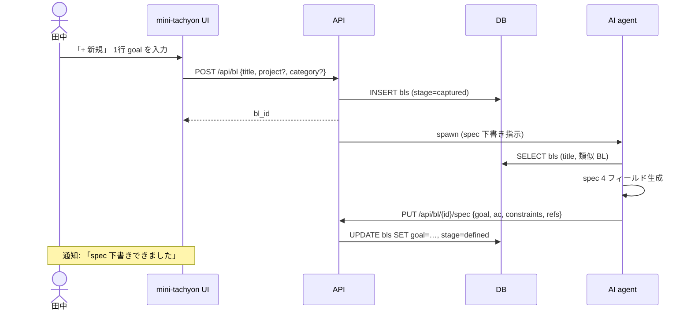
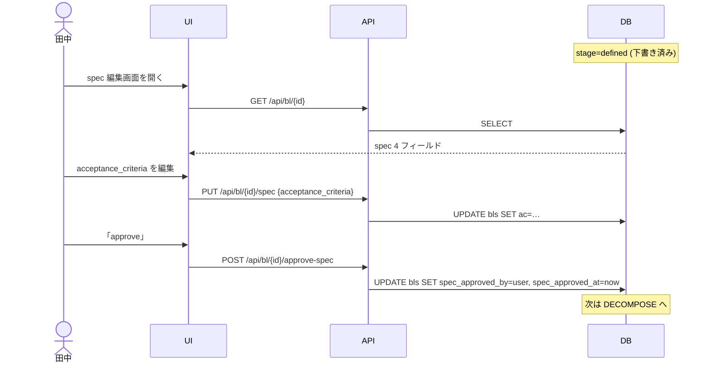
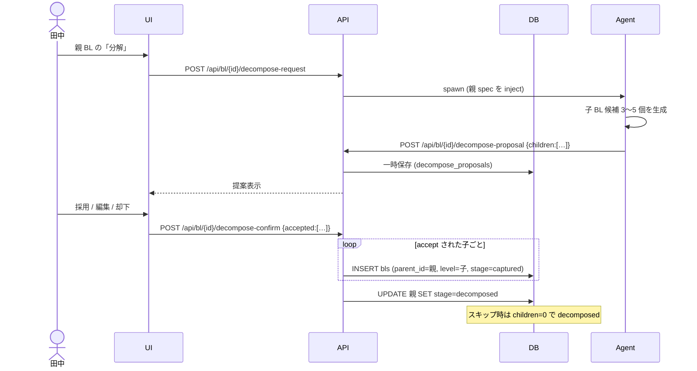
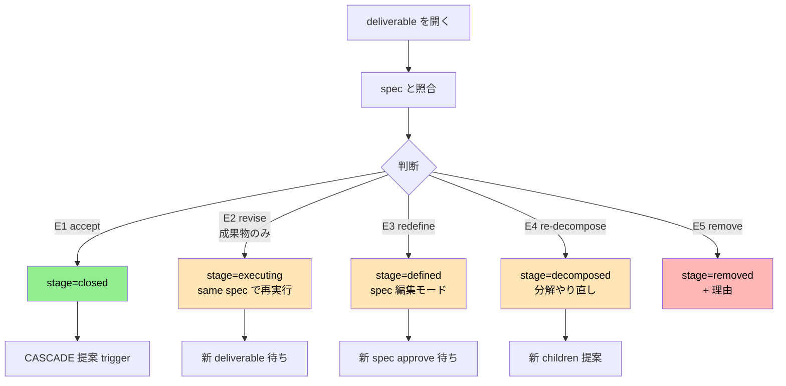
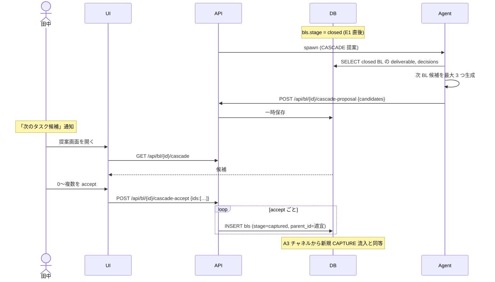

# ユースケース v2 + 主要データフロー

- 作成日: 2026-06-08
- 起票者: master (Claude)
- 関連 BL: BL-0095
- 前 doc: `data_model_and_usecases.md` (d-20260608-002)
- 目的:
  1. 田中さんの指示でユースケースを改定（削除・統合）
  2. 改定後の主要ユースケースについて Mermaid でデータフロー図を作成

---

## 1. UC 改定の適用

### 1.1 削除・統合一覧

| カテゴリ | 変更 | 理由 |
|---|---|---|
| A6 | 削除 | 不要 |
| B4, B5 | 削除 | 不要 |
| C 全体 | **趣旨を「DEFINE の中で分解する可能性」に絞る** | 後付け操作は対象外 |
| C1 + C8 | 統合: 「AI が複数子に分解」（旧 C8 の「2 個」→「複数」に汎化） | C1 と C8 は表裏一体、A4 と機能的に同じ |
| C2, C3 | 削除 | 粒度ごとの専用 UC は不要、C1 統合版に含まれる |
| C5, C6 | 削除 | 後付けの追加・親付替は範囲外 |
| C7 | 削除 | merge は「分解」の趣旨外 |
| D1 + D2 | 統合: 「BL spawn → AI 自律実行 → deliverable register」 | 同じフローの別表現 |
| H1, H4, H5, H7, H8, H9 | 削除 | 機能列挙が過剰、本質は H2/H3/H6 で表現可 |

### 1.2 改定後 UC リスト（最終）

#### A. 生成・キャプチャ
- **A1** ミーティング議事録 → AI が action item 抽出 → triage
- **A2** iPhone で「思いつき」を 1 行投稿
- **A3** CASCADE で提案された新 BL を accept
- **A4** WBS で AI が子 BL を提案 → accept（**C と表裏**）
- **A5** 既存 BL を Epic 昇格

#### B. 定義 (DEFINE)
- **B1** CAPTURE 直後に AI が spec 4 フィールド下書き
- **B2** 田中さんが受入基準を編集して approve
- **B3** REVIEW 後の redefine（REVIEW 経由）

#### C. 分解 (DECOMPOSE) — DEFINE の延長
- **C1** AI が複数子に分解（= A4）
- **C4** 「1 個で十分」で decompose スキップ

#### D. 実行 (EXECUTE)
- **D1** BL から spawn → AI 自律実行 → deliverable register（旧 D1+D2 統合）
- **D3** AI が `pending_questions` に質問を貯める
- **D4** 複数 Story を並列実行
- **D5** 失敗 N 回で escalate
- **D6** 田中さんが質問バッチ回答
- **D7** 実行中の AI に追加指示送信

#### E. レビュー (REVIEW)
- **E1** accept → CLOSE
- **E2** revise（成果物のみ）→ EXECUTE
- **E3** redefine → DEFINE
- **E4** re-decompose → DECOMPOSE
- **E5** remove → REMOVED
- **E6** 複数 deliverable 比較
- **E7** レビュー履歴の時系列参照

#### F. クローズ・カスケード
- **F1** AI が次 BL 候補を最大 3 つ提案
- **F2** 田中さんが 0〜複数を accept
- **F3** 全子 closed → 親も close 提案
- **F4** STATUS.md 自動マージ
- **F5** reopen

#### G. スケジュール（変更なし）
- G1〜G8 既存通り

#### H. 閲覧（削減後）
- **H2** テーブル一覧（フィルタ・ソート）
- **H3** WBS ツリー
- **H6** プロジェクト別 / カテゴリ別集計

#### I. AI 指示（変更なし）
- I1〜I8 既存通り

#### J. 成果物レビュー（変更なし）
- J1〜J7 既存通り

#### K. メタ操作（変更なし）
- K1〜K7 既存通り

#### L. システム保守（変更なし）
- L1〜L7 既存通り

---

## 2. 主要データフロー図

中心 4 目的のうち、ライフサイクル全体を貫く 6 ケースを diagram 化。
(A1 ミーティング / G1 朝の整理 / L1 移行は MVP スコープ決定後)

### 2.1 A2: アドホックキャプチャ → DEFINE 自動下書き



### 2.2 B1 + B2: DEFINE 完了（AI 下書き → 田中編集 → approve）



### 2.3 A4 + C1: DECOMPOSE（親 → 子複数）



### 2.4 D1 + D3: 実行と質問

```mermaid
sequenceDiagram
    actor 田中
    participant UI
    participant API
    participant DB
    participant Cockpit
    participant Agent

    田中->>UI: BL 選択 → 「実行」
    UI->>API: POST /api/bl/{id}/execute
    API->>Cockpit: spawn task (spec inject)
    API->>DB: INSERT bl_cockpit_tasks; UPDATE bls.stage=executing

    Agent->>DB: SELECT spec
    Agent->>Agent: 作業

    opt 質問発生
        Agent->>API: POST /api/bl/{id}/question {content}
        API->>DB: INSERT pending_questions
        Note over 田中: バッジ通知
        田中->>UI: 質問一覧
        田中->>UI: 回答入力
        UI->>API: POST /api/bl/{id}/answer {qid, content}
        API->>DB: INSERT decisions(type=answer); UPDATE pending_questions.resolved_at
        API->>Cockpit: send 回答 to agent
    end

    Agent->>Agent: deliverable .md 書き出し
    Agent->>API: POST /api/deliverable/register
    API->>DB: INSERT deliverables (review_state=unreviewed)
    API->>DB: UPDATE bls.stage=reviewing
    Note over 田中: 「レビュー待ち」通知
```

### 2.5 E1〜E5: REVIEW 5 分岐



DB 観点: いずれも `bls.stage` を巻き戻すだけで、他テーブルへの影響は最小。
コメントは `decisions(type='commitment'/'scope_change'/'deferred', by='user')` に追記される。

### 2.6 F1 + F2: CASCADE



---

## 3. データフローから見える観察

1. **DEFINE と DECOMPOSE は同形**: どちらも「AI が下書き／提案 → 田中さんが review/approve → DB 確定」。実装上は同じパターンを 2 回使う形になる
2. **質問は実行のブロッカー解消パス**: `pending_questions` テーブルが central。バッチ回答 UI と AI への return が肝
3. **REVIEW は最多分岐ハブ**: 5 分岐 + コメント記録。UI の決断ボタン配置が UX の要
4. **CASCADE = A3 と同一**: CAPTURE への合流チャネル。新規 BL 生成パスは「Adhoc / Meeting / Cascade / WBS」の 4 種すべてが同じ INSERT に収束
5. **すべて API 経由で DB に書き込む**: YAML 直接編集が無くなる前提で、整合性は API 層 (zod + transaction) に集約

---

## 4. UC × API endpoint マッピング（暫定）

最終決定前のラフ:

| UC | endpoint |
|---|---|
| A2 | `POST /api/bl` |
| A3 | `POST /api/bl/{id}/cascade-accept` |
| A4 / C1 | `POST /api/bl/{id}/decompose-request` → `/decompose-confirm` |
| A5 | `PUT /api/bl/{id}` (level=epic) |
| B1 | (内部、Agent → `PUT /api/bl/{id}/spec`) |
| B2 | `PUT /api/bl/{id}/spec` + `POST /api/bl/{id}/approve-spec` |
| B3 / E3 | `POST /api/bl/{id}/redefine` |
| C4 | `POST /api/bl/{id}/decompose-skip` |
| D1 | `POST /api/bl/{id}/execute` |
| D3 | `POST /api/bl/{id}/question` |
| D6 | `POST /api/bl/{id}/answer` |
| D7 | `POST /api/cockpit/{task_id}/send` |
| E1 | `POST /api/deliverable/{id}/accept` |
| E2 | `POST /api/deliverable/{id}/revise` |
| E4 | `POST /api/bl/{id}/re-decompose` |
| E5 | `POST /api/bl/{id}/remove` |
| F1 | (内部、CASCADE Agent) |
| F2 | `POST /api/bl/{id}/cascade-accept` |
| H2 | `GET /api/bl?filter=&sort=` |
| H3 | `GET /api/bl/tree?root=` |
| H6 | `GET /api/projects/stats` |

---

## 5. 次のアクション

1. 本 doc を mini-tachyon UI でレビュー
2. 改定後 UC リスト + データフロー 6 件が方向性として OK か確認
3. 確定後の次のステップ候補:
   - (a) **MVP スコープ確定** — A2 / B1+B2 / D1+D3 / E1+E5 だけを最初に実装する案
   - (b) **DB スキーマ DDL を別 deliverable で起票** — Mermaid ER → SQLite CREATE TABLE
   - (c) **残データフロー** — G1 朝の整理 / A1 ミーティング / L1 マイグレーション
   - (d) **API endpoint の最終確定** — § 4 を OpenAPI like で詳細化
4. 残課題:
   - REMOVED 理由の選択肢（保留中）
   - DB エンジン選定（SQLite 推奨）
   - 既存 100+ BL.yaml のマイグレーション手順
