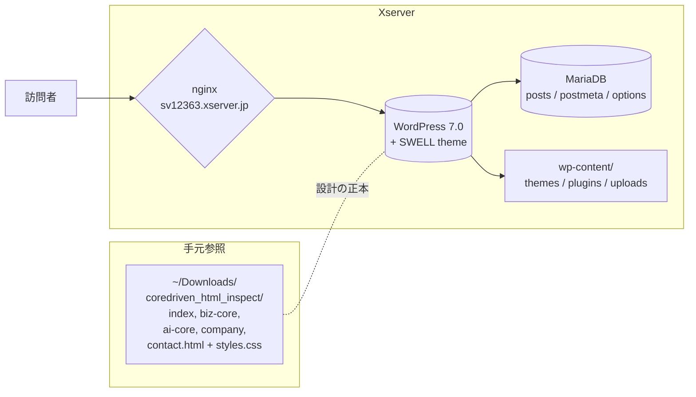
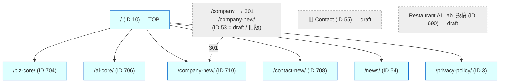
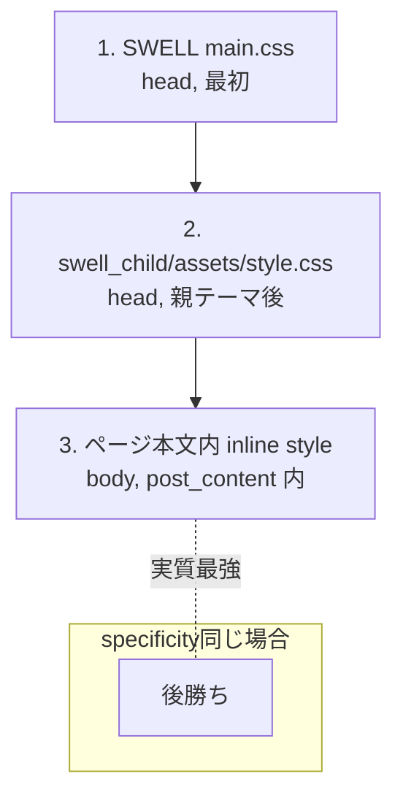
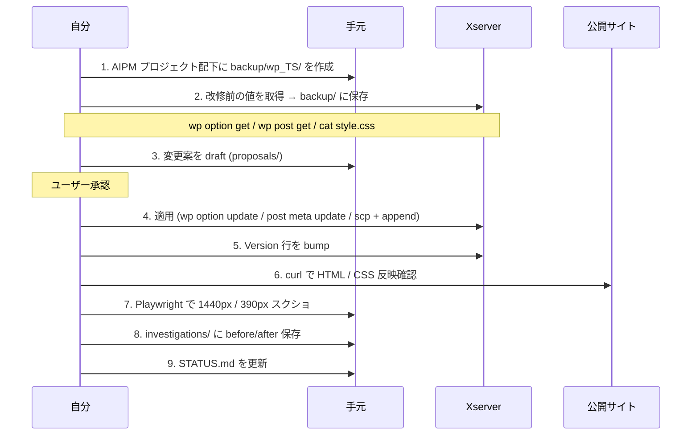

# Core Driven HP — 運用・改修ハンドブック

**対象サイト**: https://core-driven.com  
**作成**: 2026-05-26  
**前提**: macOS + zsh、 ssh / scp / curl / Playwright(Node) が手元にある

このドキュメントは、Core Driven のコーポレートサイトを CLI から安全に改修するための **構造・接続・修正手順・トラブルシュート** をまとめた申し送り資料です。
過去に踏み抜いた地雷（PHP 7.0 / SWELL specificity / `h3:before` 絶対配置）の対処法も記録しています。

---

## 1. サイト全体像



### 1.1 主要諸元

| 項目 | 値 |
|---|---|
| ドメイン | `core-driven.com` (Xserver で取得・運用) |
| サーバー | `sv12363.xserver.jp` / IP `202.233.66.44` |
| Web | nginx (Xserver 標準) |
| WordPress | 7.0 |
| デフォルト PHP | **PHP 5.4 (`/usr/bin/php`)** ⚠️ WP-CLI 実行時は **PHP 8.3 必須** |
| テーマ | **SWELL**（親） / `swell_child`（子） |
| SEO プラグイン | **SEO SIMPLE PACK** 3.6.2 |
| その他プラグイン | Redirection, Layout Grid, All-in-One WP Migration, TypeSquare Webfonts |
| 管理画面 | https://core-driven.com/wp-admin/ |

### 1.2 ページ構成



**公開ページ 7 / 下書き 3**。フロントページは固定ページ ID 10。

### 1.3 ページコンテンツの正体

> **このサイトの最重要ポイント**

各ページの本文（post_content）は、SWELL のブロックではなく `<!-- wp:html -->` ブロックの中に
**ローカル HTML（`~/Downloads/coredriven_html_inspect/*.html`）をそのまま貼り付けた構造** です。

- ローカル HTML の `<head>` にある `<link rel="stylesheet" href="assets/styles.css">` は、
  WordPress 側では **`<style>...assets/styles.css の中身を直書き...</style>`** に展開して貼り付けてある
- そのため WordPress 上でも見た目は再現される
- ただし SWELL のテーマ CSS と **クラス名が衝突**（`.container`、`h2`、`h3` 等）し、specificity 戦争が起きる
- 対策として子テーマ `swell_child/assets/style.css` の末尾に **対象ページ ID 限定の override 群**を入れている（→ §4）

---

## 2. ファイルの場所

### 2.1 サーバー側（Xserver, ユーザー `my0126`）

```
/home/my0126/core-driven.com/public_html/
├── wp-config.php                        ← DB 接続情報
├── wp-content/
│   ├── themes/
│   │   ├── swell/                       ← 親テーマ。触らない
│   │   │   └── build/css/main.css       ← SWELL の元 CSS（参照のみ）
│   │   └── swell_child/                 ← 子テーマ。CSS の追加はここ
│   │       ├── style.css                ← Version 行が enqueue キャッシュキー
│   │       └── assets/style.css         ← 実体の CSS。末尾に override
│   ├── plugins/
│   │   └── seo-simple-pack/             ← SEO プラグイン (参照のみ)
│   └── uploads/
│       └── coredriven-html/             ← ページに貼り付ける画像群
└── (その他 WordPress コア)
```

各固定ページの **本文 HTML は DB に格納** されているため、ファイルとしては存在しない。
`wp post get <id> --field=post_content` で取得 / `wp post update <id>` で書き戻し。

### 2.2 手元側（macOS, ユーザー `rikutanaka`）

```
~/Downloads/coredriven_html_inspect/      ← 設計の正本（デザイナー版）
├── index.html
├── biz-core.html
├── ai-core.html
├── company.html
├── contact.html
└── assets/styles.css                     ← 共通デザインシステム CSS

~/aipm_v0/Stock/RestaurantAILab/CoreDrivenHP/
├── README.md                             ← プロジェクト概要
├── STATUS.md                             ← 進捗チェックリスト
├── OPERATIONS.md                         ← この文書
├── backup/                               ← 改修前のスナップショット
│   ├── wp_YYYYMMDD_HHMMSS/
│   │   ├── ssp_settings.json
│   │   ├── page_<id>_before.html
│   │   └── swell_child_style.css.before
│   └── ...
├── proposals/                            ← メタ案 / 改修提案
└── investigations/                       ← Playwright スクショ・差分ログ
```

---

## 3. 接続セットアップ

### 3.1 SSH

```ini
# ~/.ssh/config
Host xserver-coredriven
    HostName sv12363.xserver.jp
    User my0126
    Port 10022
    IdentityFile ~/.ssh/id_ed25519
    ServerAliveInterval 60
```

公開鍵（`~/.ssh/id_ed25519.pub`）は Xserver サーバーパネル → アカウント → SSH設定 → 「公開鍵登録・更新」で登録済み。

接続テスト:
```bash
ssh xserver-coredriven 'hostname && whoami && pwd'
# => sv12363.xserver.jp / my0126 / /home/my0126
```

### 3.2 WP-CLI（サーバー側にプリインストール 2.4.0）

> ⚠️ **デフォルトの `/usr/bin/php` は 5.4 で WP 7.0 が動かない**。
> 必ず `/usr/bin/php8.3` を経由する。
> Deprecated 警告が大量に出るので `-d error_reporting=E_ERROR` で抑制。

**おすすめのエイリアス**（zsh の `~/.zshrc` などに置くと便利）:

```bash
alias wpcli='ssh xserver-coredriven "cd ~/core-driven.com/public_html && /usr/bin/php8.3 -d error_reporting=E_ERROR -d display_errors=0 /usr/bin/wp"'
```

これで以後 `wpcli post list` のように使える。本文書のコマンド例は alias 前提で簡略表記している箇所もある。

### 3.3 ローカルツール

```bash
# Homebrew
brew install php wp-cli  # ローカル動作確認用（任意）

# Playwright（CSS 修正の検証スクショ用）
mkdir -p /tmp/coredriven_pw && cd /tmp/coredriven_pw
npm init -y && npm install playwright
npx playwright install chromium
```

---

## 4. CSS の編集ルール（最重要）

### 4.1 CSS 読み込み順（cascade）



### 4.2 我々が触っていい場所

| 触る場所 | 用途 | リスク |
|---|---|---|
| **子テーマ `assets/style.css` の末尾** | 全ページ共通 / 複数ページの SWELL 上書き | 他ページに波及しないようスコープ必須 |
| **各固定ページの `post_content` 内 `<style>`** | そのページ固有の調整 | ページ単位なので安全。ただし `wp post update` で全文上書きになるので注意 |
| **親テーマ `swell/`** | **絶対に触らない** | SWELL アップデートで消える |

### 4.3 specificity の運用ルール

SWELL は `.post_content h2`、`.post_content h3:before` のように **`.post_content` を起点とする specificity (0,1,1)** のルールを大量に持っている。
子テーマで上書きするとき、これらと **同じ specificity に揃える** ことで、最後の inline `<style>` 内のローカル CSS が後勝ちで効くようになる。

**やり方**: 対象ページ ID をスコープにしたいが specificity は上げたくない → **`:where()`** を使う。

```css
/* ❌ ダメな例（specificity 0,2,1 でローカルの .fit-card h3 (0,1,1) を上書きしてしまう） */
.page-id-704 .post_content h3 { font-size: 18px; }

/* ✅ OK な例（:where が 0 寄与のため (0,1,1) のまま、SWELL に勝ち、ローカル inline には負ける） */
:where(.page-id-10, .page-id-704, .page-id-706, .page-id-708, .page-id-710) .post_content h3 {
  font-size: clamp(20px, 2vw, 26px);
}
```

| ルール出所 | selector | specificity | source order | 結果 |
|---|---|---|---|---|
| SWELL main.css | `.post_content h3` | 0,1,1 | 最早 | 負ける |
| 子テーマ (我々) | `:where(.page-id-X) .post_content h3` | 0,1,1 | 中間 | SWELL に勝つ |
| ページ inline | `.fit-card h3` | 0,1,1 | 最後 | 全てに勝つ |

### 4.4 キャッシュバスター

`swell_child/style.css` の `Version:` 行が CSS の `?ver=` クエリになる。
CSS を書き換えたら **必ずバージョンを上げる**:

```bash
ssh xserver-coredriven '
  STYLE=~/core-driven.com/public_html/wp-content/themes/swell_child/style.css
  perl -i -pe "s/^( Version:\s+)(\d+)\.(\d+)\.(\d+)/sprintf(\"\${1}%d.%d.%d\", \$2, \$3, \$4+1)/e" $STYLE
  grep -E "^[ ]*Version:" $STYLE
'
```

確認:
```bash
curl -s "https://core-driven.com/wp-content/themes/swell_child/assets/style.css?cb=$(date +%s)" | grep "your-marker"
```

---

## 5. 改修ワークフロー



### 5.1 メタ（Title / Description）を変える

**サイト全体（トップ）**:
```bash
wpcli option patch update ssp_settings home_title "新しいタイトル"
wpcli option patch update ssp_settings home_desc  "新しい説明文"
```

**個別ページ**:
```bash
wpcli post meta update <id> ssp_meta_title "ページタイトル"
wpcli post meta update <id> ssp_meta_description "説明文"
```

postmeta キー（SEO SIMPLE PACK 仕様）:
- `ssp_meta_title`
- `ssp_meta_description`
- `ssp_meta_keyword`
- `ssp_meta_robots`
- `ssp_meta_canonical`
- `ssp_meta_image`

確認:
```bash
curl -s https://core-driven.com/biz-core/ | grep -E "<title|name=\"description\""
```

### 5.2 ページの本文 HTML を変える

⚠️ **`post_content` は数万バイト規模なので、必ずローカルでファイルとして編集してから書き戻す**。

```bash
# 1. 取得（バックアップを兼ねる）
DATE=$(date +%Y%m%d_%H%M%S)
BACKUP=~/aipm_v0/Stock/RestaurantAILab/CoreDrivenHP/backup/wp_${DATE}
mkdir -p $BACKUP
wpcli post get 704 --field=post_content > $BACKUP/page_704_before.html

# 2. ローカルで編集
cp $BACKUP/page_704_before.html /tmp/page_704_edit.html
$EDITOR /tmp/page_704_edit.html

# 3. 書き戻し
scp -P 10022 /tmp/page_704_edit.html xserver-coredriven:/tmp/
ssh xserver-coredriven '
  cd ~/core-driven.com/public_html
  /usr/bin/php8.3 -d error_reporting=E_ERROR /usr/bin/wp post update 704 --post_content="$(cat /tmp/page_704_edit.html)"
'

# 4. 確認
curl -s https://core-driven.com/biz-core/ | grep "確認したい文言" | head
```

### 5.3 CSS を追加（複数ページ共通）

```bash
# 1. バックアップ
DATE=$(date +%Y%m%d_%H%M%S)
BACKUP=~/aipm_v0/Stock/RestaurantAILab/CoreDrivenHP/backup/wp_${DATE}
mkdir -p $BACKUP
ssh xserver-coredriven 'cat ~/core-driven.com/public_html/wp-content/themes/swell_child/assets/style.css' > $BACKUP/swell_child_style.css.before

# 2. 追記用 CSS をローカルで書く（§4.3 のルールに従う）
cat > /tmp/my_override.css <<'EOF'
/* === marker for grep === */
:where(.page-id-704) .post_content .my-thing { color: red; }
EOF

# 3. アップロード & 末尾追記
scp -P 10022 /tmp/my_override.css xserver-coredriven:/tmp/
ssh xserver-coredriven '
  cat /tmp/my_override.css >> ~/core-driven.com/public_html/wp-content/themes/swell_child/assets/style.css
'

# 4. バージョン bump（§4.4）

# 5. 確認
curl -s "https://core-driven.com/wp-content/themes/swell_child/assets/style.css?cb=$(date +%s)" | grep "marker for grep"
```

⚠️ **既存の override ブロックを差し替えたい場合**は `perl -i -0pe "s/\n\/\* === marker開始 ===.*?\/\* === marker終了 === \*\///s"` で正規表現削除してから追記。

### 5.4 ロールバック

```bash
# CSS を直前バージョンに戻す
LATEST=$(ls -1d ~/aipm_v0/Stock/RestaurantAILab/CoreDrivenHP/backup/wp_* | tail -1)
scp -P 10022 $LATEST/swell_child_style.css.before \
  xserver-coredriven:/home/my0126/core-driven.com/public_html/wp-content/themes/swell_child/assets/style.css

# ページ本文を戻す
wpcli post update 704 --post_content="$(cat $LATEST/page_704_before.html)"

# メタを戻す
wpcli option update ssp_settings --format=json < $LATEST/ssp_settings.json
```

---

## 6. つまずきポイント集（実体験）

### 6.1 ⚠️ サーバーのデフォルト PHP が 5.4 で WP-CLI が死ぬ

```
PHP Parse error:  syntax error, unexpected '?', expecting '&' or variable (T_VARIABLE)
```

→ 必ず **`/usr/bin/php8.3`** を経由（§3.2）。Xserver には `/opt/php-*/bin/php` に多バージョン入っているが、CLI 用は `/usr/bin/php8.X` を使うのが標準。

### 6.2 ⚠️ Deprecated 警告が出力を埋め尽くす

WP-CLI 2.4.0 + PHP 8.3 の組み合わせで `Creation of dynamic property ...` が大量発生。
→ `-d error_reporting=E_ERROR -d display_errors=0` で抑制。

### 6.3 ⚠️ ローカルの `<style>` が SWELL に負ける

ローカル HTML は `h2 { font-size: clamp(...) }` のような **タグ単体セレクタ (specificity 0,0,1)** を多用するが、
SWELL は `.post_content h2 { font-size: 1.2em }` (0,1,1) で必ず勝つ。

→ §4.3 の `:where()` 戦略で上書き。

### 6.4 ⚠️ `.l-container` が左右 48px パディングを足す

```
desktop: padding-left/right: 48px
tablet:  32px
mobile:  15.6px
```

→ 該当ページに対してのみ `padding: 0 !important; max-width: 100% !important` でリセット。
   全体に効かせると header / footer の幅まで崩れるので **必ず `:where(.page-id-X)` でスコープ**。

### 6.5 ⚠️ `.post_content h3:before` が `position: absolute`

SWELL の **「セクションタイトル装飾」用** に `h3:before { position:absolute; left:0; bottom:0 }` が定義されている。
ローカルの `.fit-card h3::before` は 18×18px の丸を「向いている」の前に置くつもりが、
**absolute のせいで h3 の左下隅に重なる**。

→ `:where(...) .post_content h3:before { position: static; bottom: auto; left: auto }` でリセット。
   同様の罠が `h2:before` / `h4:before` にもあるので予防的にリセット推奨。

### 6.6 ⚠️ `.post_content > *` が `margin-bottom: 2em`

SWELL がブロック間に 2em の余白を強制。カードレイアウトが間延びする。

→ 対象ページのみ `.post_content > * { margin-bottom: 0 }` で殺す（§4.3 同様 `:where()` でスコープ）。

### 6.7 ⚠️ 重複している page-id-N override の specificity 設計ミス

過去に `.page-id-X .post_content p { margin: 0 }` (0,2,1) を書いてしまい、
ローカル `.final-cta p { margin: 0 auto }` (0,1,1) を上書きしてしまった。
→ **`:where()` で 0,1,1 に下げる**ことで「SWELL は上書きできる、ローカルには負ける」を両立。

### 6.8 ⚠️ CSS を書き換えても反映されない（ブラウザ・CDN キャッシュ）

→ `swell_child/style.css` の **Version 行を上げる**（§4.4）。
   検証時の `curl` には `?cb=$(date +%s)` のような cache-busting クエリを足す。

### 6.9 ⚠️ `wp post update --post_content` で shell escape にハマる

→ 必ず `--post_content="$(cat /tmp/page.html)"` のように file 経由。
   さらに改行や `$` を含む大きな HTML はファイルからの STDIN 入力（`wp post update <id> --post_content=-< /tmp/page.html` は使えない）に注意。
   一番安全なのは PHP スクリプトを書いて `wp eval-file` で読ませる方式。

### 6.10 ⚠️ Redirection プラグインが裏で動いている

`/company` → `/company-new/` のようなリダイレクトが設定済み。
スラッグ変更時は **Redirection プラグインの設定も確認**:
```bash
wpcli redirection list  # 拡張コマンドが入っていればこれで一覧
# なければ DB を直接覗く: wpcli db query "SELECT * FROM wp_redirection_items LIMIT 20"
```

---

## 7. 検証チェックリスト

改修後、最低限これを通す。

```bash
# 1. 該当ページの HTML レンダリングが期待通り
curl -s https://core-driven.com/biz-core/ | grep "確認文言"

# 2. SEO メタが正しい
curl -s https://core-driven.com/biz-core/ | grep -E "<title|name=\"description\""

# 3. CSS に新しいルールが含まれている
curl -s "https://core-driven.com/wp-content/themes/swell_child/assets/style.css?cb=$(date +%s)" | grep "marker"

# 4. Playwright で 1440px / 390px のフルスクショ
node /tmp/coredriven_pw/compare.js  # ローカル HTML との並びを比較
```

スクショは必ず `~/aipm_v0/Stock/RestaurantAILab/CoreDrivenHP/investigations/YYYYMMDD/` に保存し、`STATUS.md` から参照する。

---

## 8. 緊急時連絡

| 事象 | 一次対応 |
|---|---|
| サイトが 500 で落ちる | Xserver サーバーパネル → エラーログ。直近の変更を §5.4 でロールバック |
| 管理画面に入れない | 同上。`wp-config.php` の DB 設定改変が無いか確認 |
| CSS 修正後に他ページが崩れた | `:where(.page-id-X)` のスコープ漏れを疑う。`swell_child/assets/style.css` の末尾 override を §5.4 で戻す |
| DB が壊れた | All-in-One WP Migration プラグインの最新バックアップから復元 |

---

## 9. 次に着手すべきこと（残課題）

- [ ] Final CTA 本文 `<p>` の `max-width: 680px` を 760px 程度に拡張（「す。」一文字折り返し問題）
- [ ] 旧 Contact 下書き (ID 55) と 投稿下書き Restaurant AI Lab. (ID 690) の要否確認 → 削除 or 公開
- [ ] AI Core / Contact-new / Company-new の目視確認（CSS 適用済みだが画面チェック未）
- [ ] ローカル HTML を **デザインの正本** として Git 管理（現状は `~/Downloads/` 配下で散逸リスク）
- [ ] 子テーマ override CSS を **`_swl-overrides.scss` のような独立ファイル**に分割して管理（現状は assets/style.css 末尾に追記の積み重ね）

---

## 付録 A. 主要コマンドのチートシート

```bash
# 接続
ssh xserver-coredriven

# WP-CLI 一発実行
alias wpcli='ssh xserver-coredriven "cd ~/core-driven.com/public_html && /usr/bin/php8.3 -d error_reporting=E_ERROR -d display_errors=0 /usr/bin/wp"'

# ページ一覧
wpcli post list --post_type=page --post_status=publish,draft --fields=ID,post_title,post_status,post_name

# プラグイン一覧
wpcli plugin list --status=active --fields=name,title,version

# テーマ一覧
wpcli theme list --status=active

# オプション系
wpcli option get ssp_settings --format=json
wpcli option get blogname
wpcli option get page_on_front

# ページ本文の取得
wpcli post get 10 --field=post_content > /tmp/page_10.html

# ページのメタ
wpcli post meta list 704 --fields=meta_key,meta_value

# 公開ステータス変更
wpcli post update 53 --post_status=draft

# CSS のキャッシュバスト確認
curl -s "https://core-driven.com/wp-content/themes/swell_child/assets/style.css?cb=$(date +%s)" | wc -c
```

## 付録 B. 関連ドキュメント

- `README.md` — プロジェクト概要
- `STATUS.md` — 進捗チェックリスト
- `investigations/root_cause_20260526.md` — 初回レイアウト崩れの原因分析
- `backup/wp_*` — 改修前スナップショット（日付昇順）
