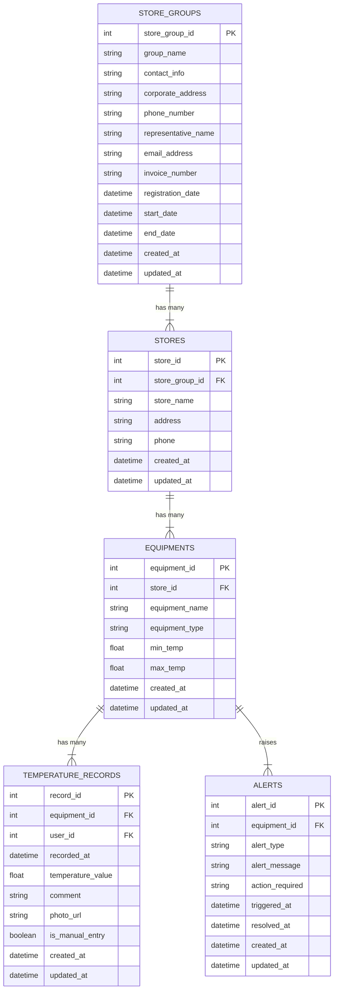

```mermaid
erDiagram

    %% =====================
    %%    STORE_GROUPS
    %% =====================
    STORE_GROUPS {
        int store_group_id PK
        string group_name
        string contact_info
        string corporate_address
        string phone_number
        string representative_name
        string email_address
        string invoice_number
        datetime registration_date
        datetime start_date
        datetime end_date
        datetime created_at
        datetime updated_at
    }

    %% =====================
    %%       STORES
    %% =====================
    STORES {
        int store_id PK
        int store_group_id FK
        string store_name
        string address
        string phone
        datetime created_at
        datetime updated_at
    }

    %% =====================
    %%     EQUIPMENTS
    %% =====================
    EQUIPMENTS {
        int equipment_id PK
        int store_id FK
        string equipment_name
        string equipment_type
        float min_temp
        float max_temp
        datetime created_at
        datetime updated_at
    }

    %% =====================
    %%  TEMPERATURE_RECORDS
    %% =====================
    TEMPERATURE_RECORDS {
        int record_id PK
        int equipment_id FK
        int user_id FK
        datetime recorded_at
        float temperature_value
        string comment
        string photo_url
        boolean is_manual_entry
        datetime created_at
        datetime updated_at
    }

    %% =====================
    %%       ALERTS (任意)
    %% =====================
    ALERTS {
        int alert_id PK
        int equipment_id FK
        string alert_type
        string alert_message
        string action_required
        datetime triggered_at
        datetime resolved_at
        datetime created_at
        datetime updated_at
    }

    %% =====================
    %%   リレーション定義
    %% =====================

    STORE_GROUPS ||--|{ STORES : "has many"

    STORES ||--|{ EQUIPMENTS : "has many"

    EQUIPMENTS ||--|{ TEMPERATURE_RECORDS : "has many"

    EQUIPMENTS ||--|{ ALERTS : "raises"

```
