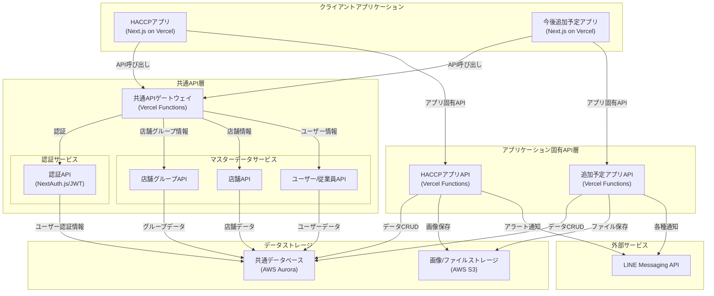

# システム設計

## 全体アーキテクチャ

システムは以下のようなアーキテクチャで構成されます。HACCP アプリと今後追加予定アプリは疎結合を保ちながら、共通の API とデータベースを利用する設計となっています。



## アーキテクチャの特徴

### 主要コンポーネント

1. **クライアントアプリケーション層**

    - 各アプリケーションは独立した Next.js アプリとして Vercel 上に構築
    - HACCP アプリと今後追加予定アプリはそれぞれ独立したリポジトリで管理
    - 各アプリは独自の UI/UX を持ち、特定のビジネス要件に最適化可能

2. **共通 API 層**

    - 複数アプリケーションで共有される基本的な情報を管理する API
    - **認証サービス**: パスワード認証を一元管理（NextAuth.js/JWT ベース）
    - **マスターデータサービス**:
        - 店舗グループ API: 企業・店舗グループの基本情報管理
        - 店舗 API: 店舗の基本情報管理
        - ユーザー/従業員 API: ユーザーと権限の基本情報管理

3. **アプリケーション固有 API 層**

    - 各アプリケーション専用のビジネスロジックとエンドポイントを提供
    - HACCP アプリ API: 温度記録、設備管理、アラートなどの機能を提供
    - 追加予定アプリ API: 追加予定アプリケーション固有の機能を提供

4. **データストレージ層**

    - 共通データベース(AWS Aurora): すべてのデータを保存
    - 画像/ファイルストレージ: 温度記録の写真や各種ドキュメントを保存

5. **外部サービス連携**
    - LINE Messaging API: 各種通知やアラートの配信

### アーキテクチャの利点

1. **疎結合の実現**

    - 各アプリケーションは互いに独立して開発・デプロイ可能
    - アプリケーション固有のビジネスロジックは専用 API に隔離
    - アプリケーション間の直接的な依存関係が存在しない

2. **共通リソースの効率的利用**

    - 認証システムの一元管理によるセキュリティ向上
    - 店舗・ユーザー情報の重複管理を回避
    - データの一貫性確保

3. **拡張性の確保**
    - 新しいアプリケーションを追加する際も既存の共通 API 層を活用可能
    - マイクロサービス的なアプローチにより特定機能の拡張が容易

## 実装戦略

### プロジェクト構成

```
/restaurant-management/
├── /common-api/           # 共通API層
│   ├── /auth/             # 認証サービス（パスワード認証）
│   ├── /store-groups/     # 店舗グループAPI
│   ├── /stores/           # 店舗API
│   └── /users/            # ユーザーAPI
│
├── /haccp-app/            # HACCPアプリ（独立リポジトリ）
│   ├── /frontend/         # Next.jsフロントエンド
│   └── /api/              # アプリ固有API
│
└── /future-apps/          # 追加予定アプリ（独立リポジトリ）
    ├── /frontend/         # Next.jsフロントエンド
    └── /api/              # アプリ固有API
```

### デプロイモデル

-   共通 API: 単一の Vercel プロジェクトとして展開
-   各アプリケーション: 別々の Vercel プロジェクトとして展開
-   データベース: 単一の AWS Aurora インスタンス内で論理的な分離

### 認証フロー

-   ユーザーはアプリからパスワード認証でログイン
-   JWT トークンを共通認証 API から取得
-   トークンを使って共通 API とアプリ固有 API の両方にアクセス

### 通知システム

-   各アプリケーション固有 API が LINE Messaging API と連携
-   温度異常アラートや各種通知を LINE Messaging API を通じて配信
-   ユーザーへのメッセージは店舗や役割に基づき適切にルーティング

### データアクセスパターン

-   共通データ: 共通 API を経由してアクセス
-   アプリ固有データ: 各アプリの API を経由してアクセス
-   必要に応じて、アプリ固有 API から共通 API を内部呼び出し

## テクニカルスタック

1. **フロントエンド**

    - Next.js (App Router)
    - React
    - TypeScript
    - Tailwind CSS

2. **バックエンド**

    - Next.js API Routes (サーバーレス関数)
    - Prisma ORM（データベース接続）
    - NextAuth.js（認証）
    - Zod（バリデーション）

3. **データベース**

    - AWS Aurora (サーバーレス MySQL)
    - Prisma Migrations（スキーマ管理）

4. **ストレージ**

    - AWS S3 (オブジェクトストレージ)

5. **CI/CD**

    - GitHub Actions
    - Vercel 自動デプロイ

6. **通知システム**
    - LINE Messaging API
