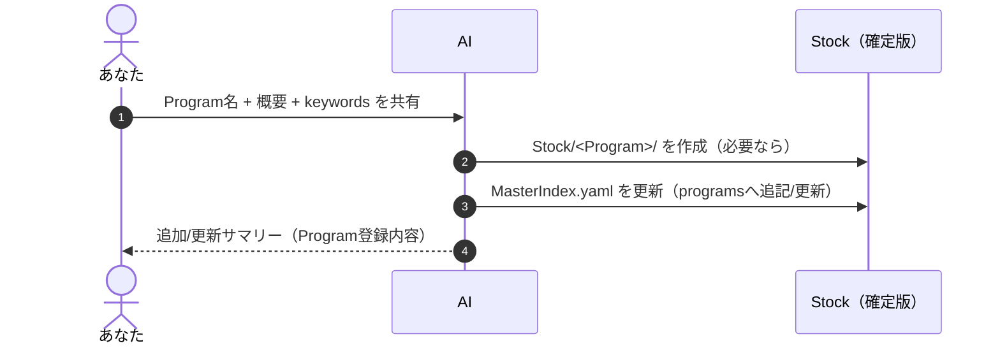
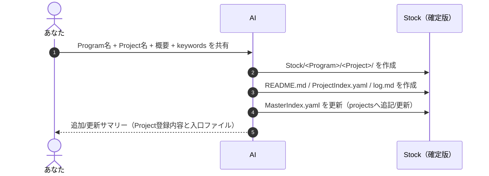
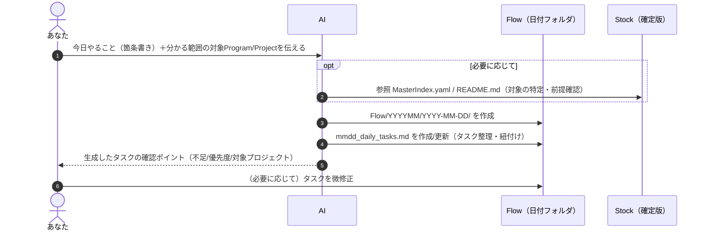
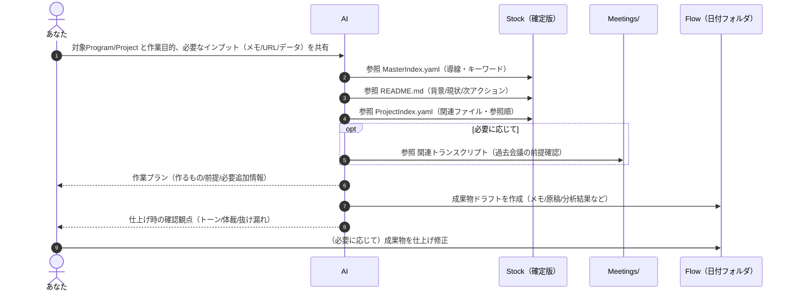
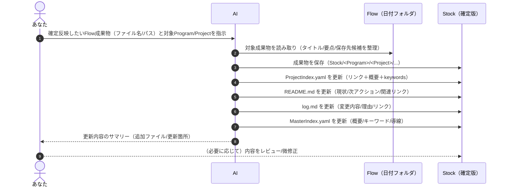
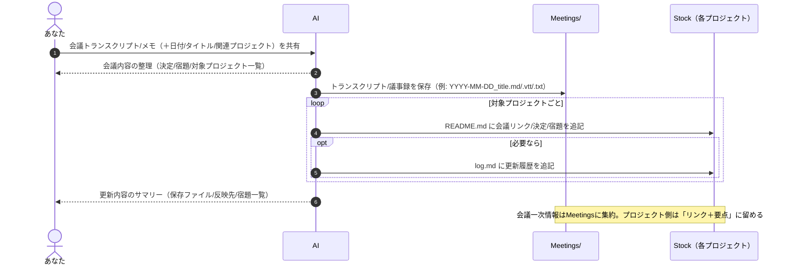

# フォルダ階層・運用ルール（ToBe像）

作成日: 2026-01-15  
目的: **仕事のコンテキストをAIに渡しやすい形で一元管理**し、Flow→Stock確定反映の判断コストを最小化する。

## ゴール（ToBe像の要点）
- **Flow**: 日々の作業（WIP）を時系列で残す場所。月/日付で整理する運用は維持。
- **Stock**: AIが参照する「確定版」の置き場。**迷わない入口（MasterIndex.yaml / ProjectIndex.yaml / README.md）**を必ず用意。
- **Meetings**: 1回の会議で複数プロジェクトが混ざる前提のため、**Stockの外で横串保管**し、各プロジェクトからは「リンク」で参照する。

## 基本的な考え方（運用原則）
- **1日の作業はFlow内で行う**
- **Flowの下は月ごと、日付ごとにフォルダ分けされている**
- **作業中、過去に作成したものはAIやユーザーがStockを参照する**
- **確定したものを順次Stockに保存する**
- **Stockの直下はプログラム、プロジェクトという単位でフォルダ分けされている**
- **Stock直下に `MasterIndex.yaml` を置く**（全プログラム/プロジェクトの概要・キーワード・参照導線。AI専用）
- **プロジェクト直下に `README.md` / `ProjectIndex.yaml` / `log.md` を置く**（AI専用Index + 人間向けREADME + 履歴）
- **Stockへ保存したら、必ず `MasterIndex.yaml` / `ProjectIndex.yaml` / `README.md` / `log.md` も更新する（AIが実施）**
- **Stock参照時は、AIが `MasterIndex.yaml` → `README.md` / `ProjectIndex.yaml` を起点に参照ファイルを判断する**
- **会議トランスクリプトは `Meetings/`（Stockの外）に集約する**
- **会議情報をプロジェクトに反映するときは「リンク＋要点」だけを `README.md` に追記する（Indexは更新しない想定）**
- **ユーザーのファイル操作は最小限**（基本はAIとの対話で作成/更新し、最後に必要ならユーザーが仕上げ修正）

## フォルダ階層（ToBe）

### Flow（WIP / 日次作業）

```
Flow/
  YYYYMM/
    YYYY-MM-DD/
      mmdd_daily_tasks.md
      ...（作業メモ / ドラフト / 途中成果物）
```

### Stock（確定版・AIが参照する“正”）

```
Stock/
  MasterIndex.yaml
  <Program>/
    <Project>/
      README.md
      ProjectIndex.yaml
      log.md
      ...（プロジェクトの成果物ファイル。フォルダは必要に応じて追加）
```

### Meetings（会議トランスクリプト / 議事録：横串・Stockの外）

```
Meetings/
  YYYY-MM-DD_<meeting-title>.md
  YYYY-MM-DD_<meeting-title>.vtt
  YYYY-MM-DD_<meeting-title>.txt
  ...（会議トランスクリプト/議事録を「直下」に保存）
```

### フォルダ構成の要点（テーブル）

| ルート | 役割 | 代表ファイル/規約 |
|---|---|---|
| `Flow/` | 日次の作業場所（WIP） | `Flow/YYYYMM/YYYY-MM-DD/mmdd_daily_tasks.md` を起点 |
| `Stock/` | 確定版の参照場所（AI/人の“正”） | `Stock/MasterIndex.yaml` を起点 |
| `Meetings/` | 会議トランスクリプト/議事録の集約（横串） | `YYYY-MM-DD_<title>.<ext>` で直下保存（`.md`/`.txt`/`.vtt`等） |
| `Stock/<Program>/<Project>/` | プロジェクトの確定成果物置き場 | `README.md` / `ProjectIndex.yaml` / `log.md` を必須 |

## 必須ファイル要件（Stock側）

### `Stock/MasterIndex.yaml`（全体マスターインデックス / AI専用）
- **目的**: ユーザー入力に対してAIが「どのプロジェクトのREADMEを読むべきか」を判断できるようにする“全体地図（機械可読）”。
- **必須項目（Program）**:
  - `summary`（概要）
  - `keywords`（検索用キーワード）
  - `projects`（配下プロジェクト辞書）
- **必須項目（Project）**:
  - `summary`（概要）
  - `keywords`（検索用キーワード）
  - `path`（プロジェクトフォルダへのパス）
  - `readme`（READMEへのパス）
  - `index`（ProjectIndex.yamlへのパス）
- **更新ルール**:
  - プログラム初期化/プロジェクト初期化時に必ず追記する
  - Stockへ成果物を保存したら、必要に応じて `summary/keywords` を更新する（AIが実施）

### `Stock/<Program>/<Project>/README.md`（背景・目的・現状）
- **目的**: このプロジェクトのコンテキスト入口（背景/目的/現状を最短で把握）。
- **必須項目**:
  - 背景 / 目的
  - 現在の状況（最新の論点、次アクション）
  - 関係者（意思決定者/連絡先の扱いはポリシーに従う）
  - 重要リンク（`ProjectIndex.md`、主要成果物、関連会議）
- **更新ルール**: 会議や確定成果物で状況が変わったら、必ず更新する。

### `Stock/<Program>/<Project>/ProjectIndex.yaml`（プロジェクト内インデックス / AI専用）
- **目的**: ユーザー入力に対してAIが「このプロジェクト内のどのファイルを参照すべきか」を判断できるようにする“プロジェクト内地図（機械可読）”。
- **必須項目**:
  - `files`: 配下ファイルのカタログ（最低限 `path`, `summary`, `keywords`）
  - `canonical`: 入口ファイルのパス（`readme`, `log` など）
- **更新ルール**:
  - 新しいファイルをStockに追加したら、必ず `files` に追記する（AIが実施）
  - ファイルの役割が変わったら `summary/keywords` を更新する（AIが実施）

### `Stock/<Program>/<Project>/log.md`（更新履歴）
- **目的**: 「いつ・何を・なぜ」更新したかの履歴を残し、AIが変更の流れを追えるようにする。
- **推奨フォーマット**（例）:
  - 日付 / 変更内容 / 変更理由 / 関連ファイルリンク / 担当（任意）
- **更新ルール**: Stockへの保存（新規/更新）と同時に追記する。

## 運用フロー一覧（番号つき）

| No | 運用フロー | ゴール（完了条件） | 入力（最低限） | 参照先（Stock/他） | アウトプット（作成/更新） |
|---:|---|---|---|---|---|
| 1 | プログラム初期化（AIがStock生成＋MasterIndex追記） | Programが作成され、`MasterIndex.yaml` に概要/キーワードが登録されている | Program名、Program概要、keywords | `Stock/MasterIndex.yaml` | `Stock/<Program>/` 作成 + `Stock/MasterIndex.yaml` 更新 |
| 2 | プロジェクト初期化（AIがStock生成＋MasterIndex/ProjectIndex生成） | Projectが作成され、README/ProjectIndex/logが生成され、MasterIndexに登録されている | Program名、Project名、Project概要、keywords | `Stock/MasterIndex.yaml` | `Stock/<Program>/<Project>/` 作成 + `README.md`/`ProjectIndex.yaml`/`log.md` 作成 + `MasterIndex.yaml` 更新 |
| 3 | 1日のタスク計画（AIがFlow生成） | 今日やることが明確で、Flowに日次フォルダ/タスクが生成されている | 今日やること（箇条書きでOK）、対象 `Program/Project`（分かる範囲） | （必要に応じてAIが参照）`Stock/MasterIndex.yaml` / 各 `README.md` | AIが `Flow/YYYYMM/YYYY-MM-DD/` と `mmdd_daily_tasks.md` を作成/更新（最後にユーザーが必要なら微修正） |
| 4 | プロジェクト作業（AI対話→Flow成果物作成） | AIが必要文脈を参照し、Flowに成果物が作られている | 対象 `Program/Project`、作業目的、必要なインプット（メモ/URL/データ） | （必要に応じてAIが参照）`MasterIndex.yaml` → `README.md` / `ProjectIndex.yaml`、関連成果物、必要なら `Meetings/` | AIがFlowにドラフト/成果物を作成（最後にユーザーが必要なら仕上げ編集） |
| 5 | Stockへ確定反映（AIが保存＋README/MasterIndex/ProjectIndex更新） | 指定した成果物がStockに保存され、README/MasterIndex/ProjectIndex/logが最新 | 確定対象（Flowファイルの指定）、対象 `Program/Project`、保存先の希望（任意） | AIが `MasterIndex.yaml` / `ProjectIndex.yaml` / `README.md` / `log.md` を参照 | AIが Flow→Stock 保存 + `MasterIndex.yaml` / `ProjectIndex.yaml` / `README.md` / `log.md` を更新（最後にユーザーがレビュー） |
| 6 | 会議終了（AIがMeetings保存＋README更新） | 会議情報が `Meetings/` に保存され、関連プロジェクトの `README.md` が更新されている | 会議トランスクリプト/メモ、会議タイトル/日付、関連プロジェクト | AIが `Meetings/` と関連 `README.md` を参照 | AIが `Meetings/` に保存 + 関連 `README.md` を更新（必要なら `log.md` を更新。Indexは更新しない。最後にユーザーがレビュー） |

## 運用フロー別シーケンス図（Mermaid）

### 1. プログラム初期化（AIがStock生成＋MasterIndex追記）



### 2. プロジェクト初期化（AIがStock生成＋MasterIndex/ProjectIndex生成）



### 3. 1日のタスク計画



### 4. プロジェクト作業（AI対話→Flow成果物作成）



### 5. Stockへ確定反映（AIが保存＋README/MasterIndex/ProjectIndex更新）



### 6. 会議終了（AIがMeetings保存＋README更新）



